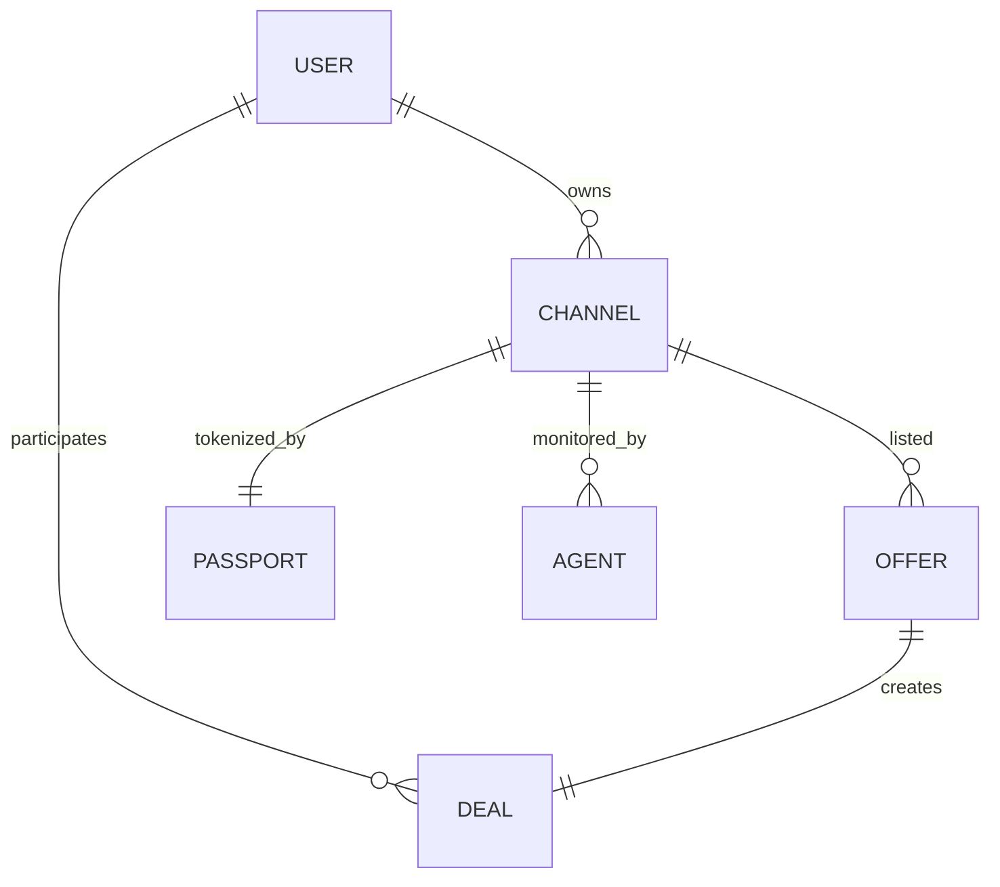

## EN — Data Model

### Core Entities

| Entity       | Symbol | Description                                                                         |
| ------------ | ------ | ----------------------------------------------------------------------------------- |
| **User**     | `U`    | Telegram account interacting with ITOhub. Holds wallet, rating, history.            |
| **Channel**  | `C`    | Digital asset (Telegram channel). Stores metrics, owner, sale status.               |
| **Offer**    | `O`    | Listing for a deal (channel sale or ad posting). Has price, code, status.           |
| **Deal**     | `D`    | Escrow contract instance. Connects buyer & seller, locks TON funds.                 |
| **Passport** | `P`    | Token Passport — TIP‑3 token with metadata (ownership, history, metrics).           |
| **Agent**    | `A`    | Swarm Agent linked to a channel. Collects metrics, provides insights, votes in DAO. |

### Relations

* `U` ↔ `C` — A user owns one or multiple channels.
* `C` → `O` — A channel can have one active public offer.
* `O` → `D` — When accepted, an offer becomes a deal.
* `D` locks TON funds until resolution.
* `C` ↔ `P` — A channel can be tokenized via a Passport.
* `A` ↔ `C` — Each channel can run its own Swarm Agent.

### States

* **Offer** → `draft` → `active` → `accepted` → `closed/cancelled`
* **Deal** → `pending_payment` → `funded` → `resolved` / `disputed`
* **Passport** → `issued` → `active` → `burned`

---
