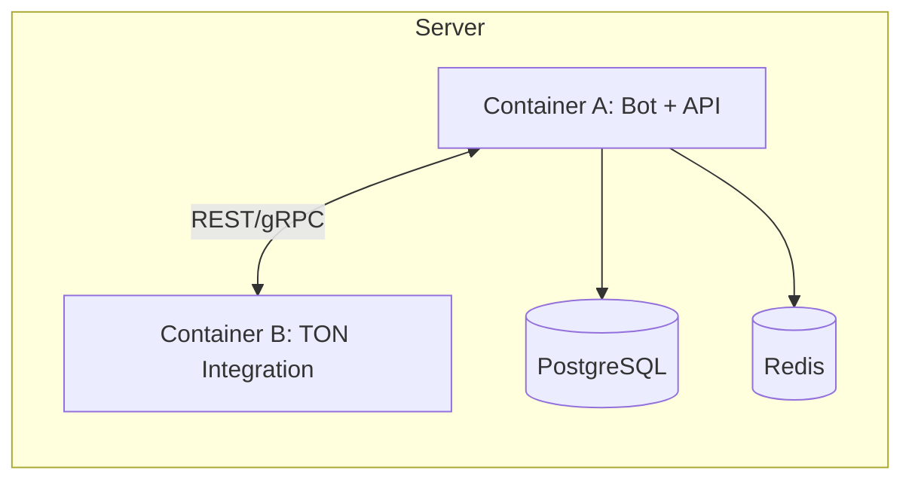

## EN — System Overview

### Purpose

**ITOhub** is a TON‑native Web3 platform for **secure P2P deals inside Telegram**. It enables safe transfer of channel ownership and ad slots through **smart‑contract escrow** while keeping the whole user journey inside a **Telegram Mini App & Bot**.

### High‑Level Architecture

* **Telegram Mini App & Bot** — user UI for offers, deals, payments, notifications.
* **Backend Service (FastAPI, Dockerized)** — business logic, auth, sessions, validations.
* **Database Layer** — **PostgreSQL** (users, channels, offers, deals), **Redis** (sessions, cache, rate‑limits).
* **TON Smart Contracts** — escrow (fund, lock, resolve, distribute protocol fee).
* **CI/CD** — GitHub Actions (tests, build, deploy).

```mermaid
flowchart TB
  U[User via Telegram] --> M[Telegram Mini App & Bot]
  M --> API[Backend API (FastAPI)]
  API --> DB[(PostgreSQL)]
  API --> REDIS[(Redis)]
  API <--> TON[TON Smart Contracts (Escrow)]
  CI[CI/CD (GitHub Actions)] --> API
```

### Deployment Model (MVP)

* **Single server** with Docker:

  * **Container A:** Bot + API + (optionally) DB.
  * **Container B:** TON integration module (SDK / light client).
* Internal **docker network** between containers (REST/gRPC).
* **Roadmap:** migrate to **Kubernetes** for horizontal scaling and independent DB/Redis nodes.



### Security & Trust Principles

* **On‑chain escrow** eliminates counter‑party risk.
* **JWT auth via Telegram WebApp** for identity (signed `initData`).
* **TLS** for all API endpoints.
* **Anti‑fraud (planned):** anomaly detection, behavior limits, reputation/risk scoring.

### Key Flows (happy‑path)

1. **Create Offer** (channel sale / ad posting) in Mini App.
2. **Join Deal** (public list or by **offer code**).
3. **Fund Escrow** in **TON**; funds remain locked.
4. **Seller Action** (e.g., transfer channel rights or place ad).
5. **Resolve** → escrow pays out; **3% protocol fee** retained; gas fees on chain.
6. **Dispute** (if needed) → DAO/arbiter policies (post‑MVP).

> **See also:**
>
> • Architecture → **Data Model** (entities & relations)
>
> • **Smart Contract** → escrow states & transitions

---


