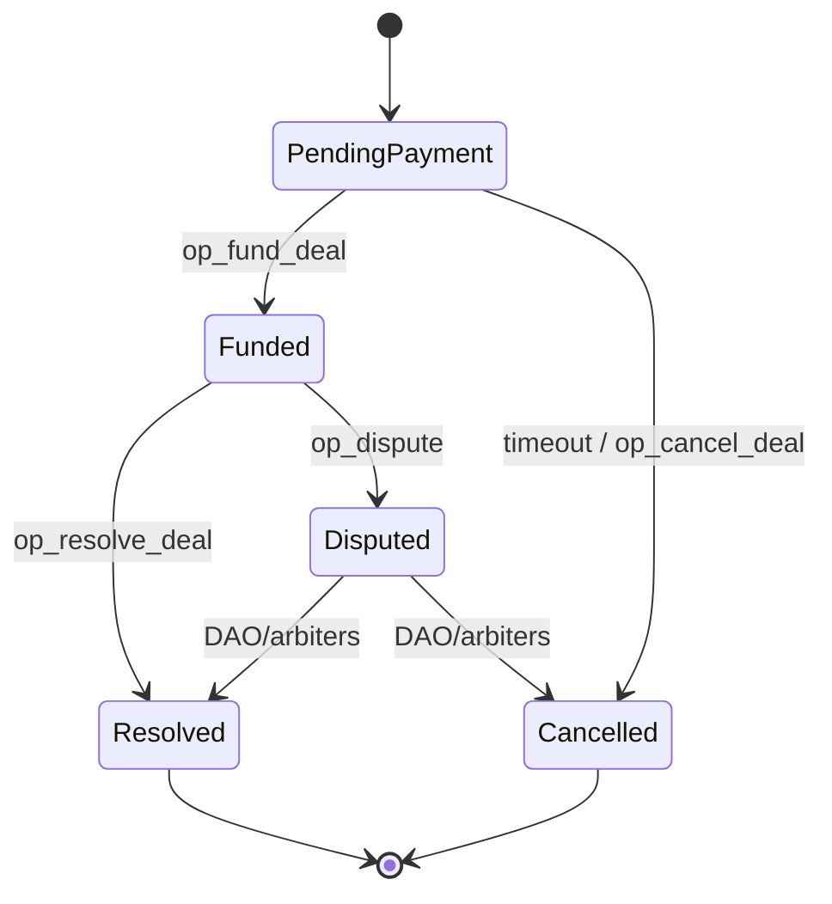

# Smart Contract Overview / Обзор смарт-контракта

> **Target files:**
>
> • `en/smart-contract/overview.md`
>
> • `ru/smart-contract/overview.md`

---

## EN — Smart Contract Overview

### 1. Purpose

The ITOhub smart contract ensures **escrow-protected P2P deals** on the TON blockchain. Funds are locked until the seller fulfills obligations (channel transfer, ad placement, bot rental).

### 2. State Machine

### 3. Transactions & Ops

| Code              | Operation   | Actor            | Effect                          |
| ----------------- | ----------- | ---------------- | ------------------------------- |
| `op_create_deal`  | Create deal | Seller/Buyer     | Init escrow contract            |
| `op_fund_deal`    | Fund deal   | Buyer            | Lock TON funds                  |
| `op_resolve_deal` | Resolve     | Seller+Buyer     | Release funds to seller –3% fee |
| `op_cancel_deal`  | Cancel      | Timeout / mutual | Refund buyer                    |
| `op_dispute`      | Dispute     | Buyer/Seller     | Escalate to DAO/arbiters        |

### 4. World-State (σ)

* σ : id → { User, Channel, Deal, Passport, Offer }
* **On-chain:** escrow status, wallets, Token Passport root.
* **Off-chain:** metrics, extended history (Postgres, Redis, IPFS).

### 5. Fees & Gas

* Protocol fee: **3%** flat.
* Gas: ≈ **0.02 TON** per tx.
* Future: referrer share, treasury split, burn.

