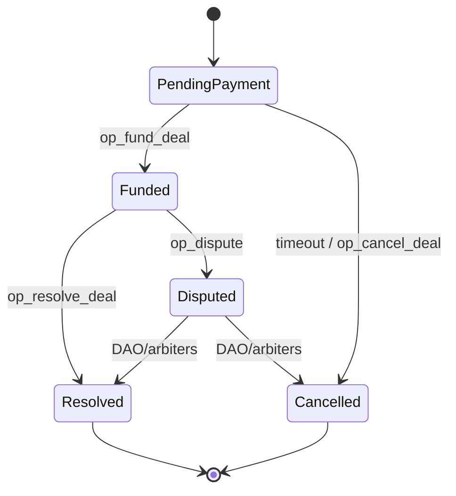

## EN — Smart Contract Overview

### Purpose

The **ITOhub smart contract** is designed to manage **escrow-based P2P deals** on the TON blockchain. It ensures that buyer funds are locked until the seller fulfills obligations (channel transfer, ad placement, bot rental, etc.).

### Core Functions

* **Create Deal** (`op_create_deal`) — initializes escrow with buyer/seller IDs, asset reference, and amount.
* **Fund Deal** (`op_fund_deal`) — buyer locks funds in TON; deal moves to *funded* state.
* **Resolve Deal** (`op_resolve_deal`) — on successful completion, funds are released to seller minus protocol fee.
* **Cancel Deal** (`op_cancel_deal`) — if unpaid within timeout, or by mutual consent before funding.
* **Dispute** (`op_dispute`) — optional, escalates to DAO/arbiters (future stage).

### State Machine

### Fees

* **Protocol fee:** 3% flat per deal.
* **Gas fees:** \~0.02 TON per transaction (paid on-chain).
* Future extensions: referrer share, burn/treasury split.

### Security

* Immutable contract on TON.
* Timeouts prevent deadlocks.
* All state transitions logged on-chain.
* Dispute mechanism designed for DAO/arbiters.

---