# Managing Ad Creatives (Ads)

Create and edit the content of your **Telegram ad post** via the ITO bot.  
This flow lets you send text/media in Telegram and keep the final preview exactly as it will appear.

---

## Step 1 — Open **My ads**
From the main screen, tap **My ads**.

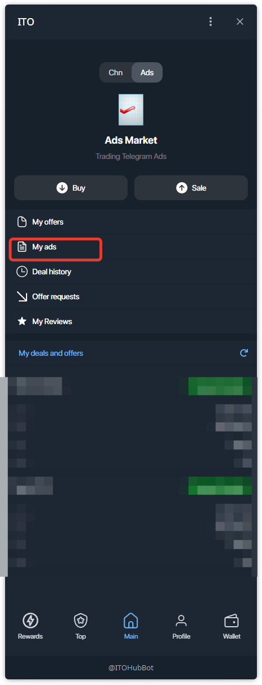

## Step 2 — My Ads list
Here you can see and manage your creatives. Tap **+** to create a new ad.

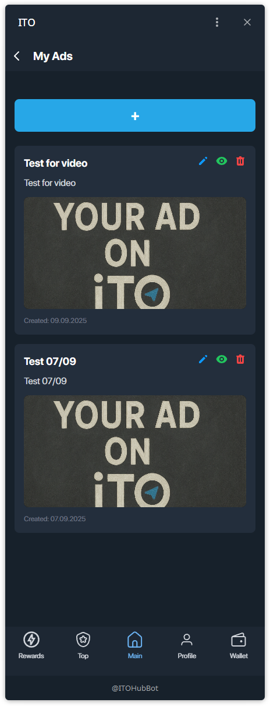

## Step 3 — Create Ad via Telegram
Choose the **Create Ad via Telegram** method.  
You’ll edit content through the bot: upload media, forward from other chats, and see instant previews.

## Step 4 — Set a title → Continue in Telegram
Enter a short internal title (for your reference) and press **Continue in Telegram**.

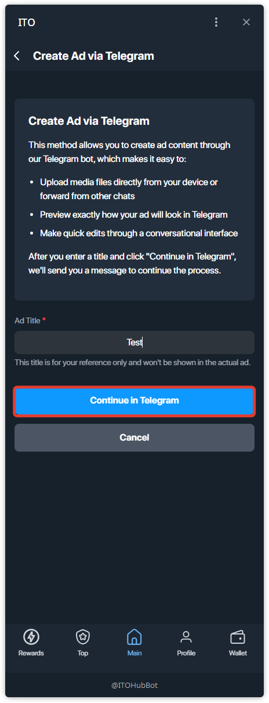

## Step 5 — Edit Ad Content (mini app view)
Back in the mini app, the **Edit Ad Content** card shows the actions.  
Important: **text and media are edited only via the Telegram bot**; use the buttons to jump to the bot.

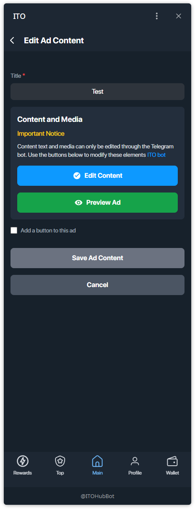

## Step 6 — Send ad **text** in Telegram
The bot will message you: “Please send the text for your ad #…”.  
Reply with the text that must appear in the post.

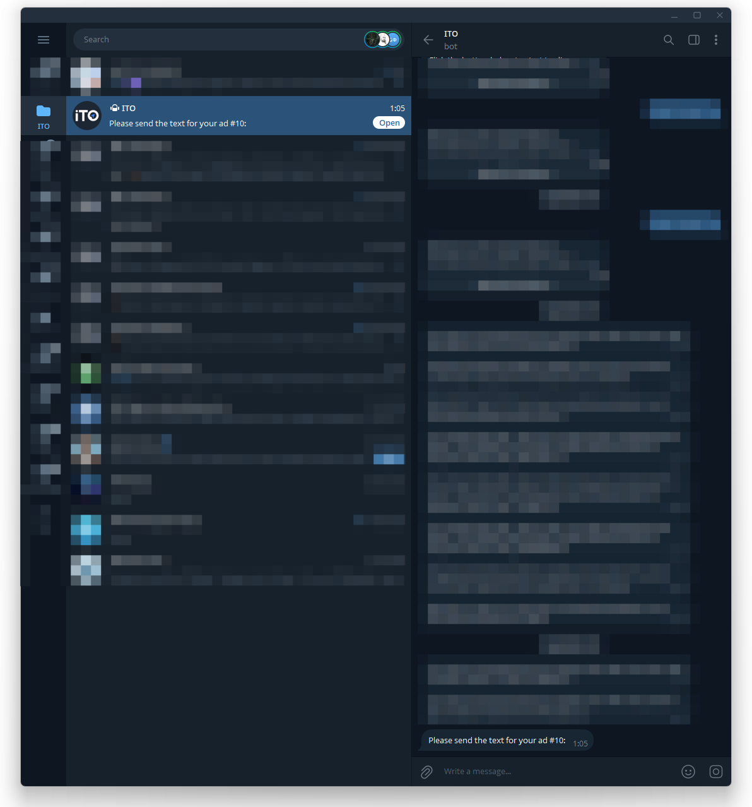
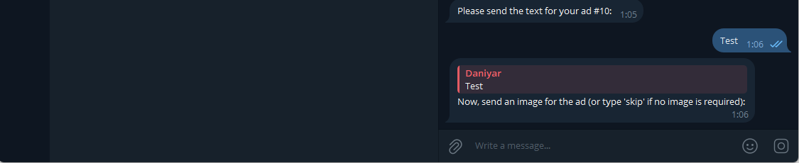

## Step 7 — Send **image** (optional)
If the ad needs an image, send it to the bot now. If not, type `skip`.

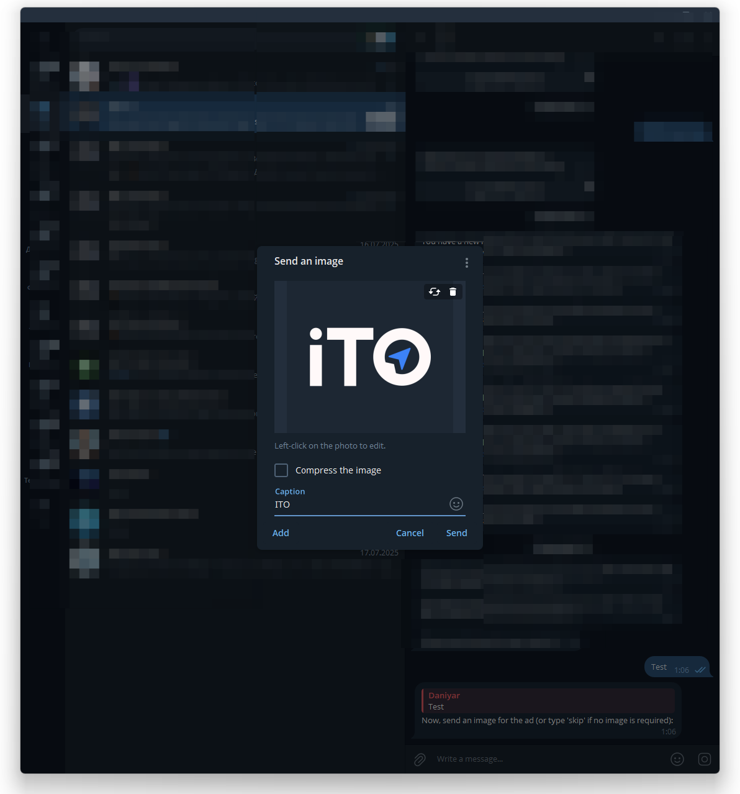
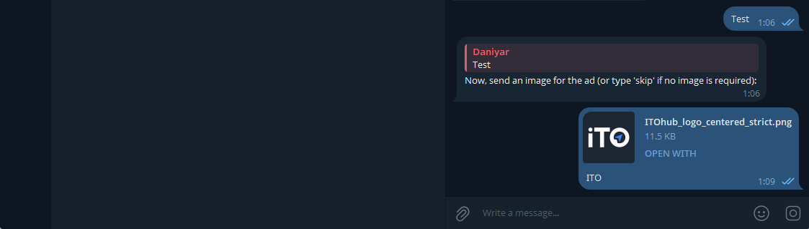

## Step 8 — **Preview & Confirm** in Telegram
The bot will send an **Ad Preview** with buttons:
- **Edit Text** — change the text,
- **Edit Media** — change the image,
- **Confirm** — finalize the creative.

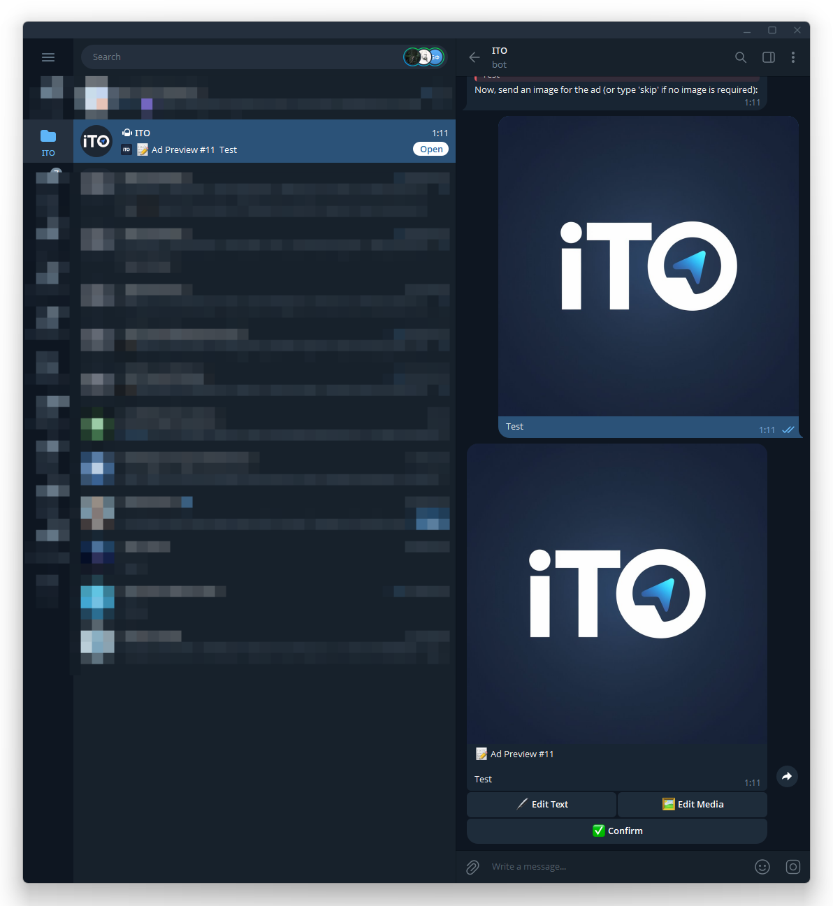

After confirmation you will also receive a success message from the bot:

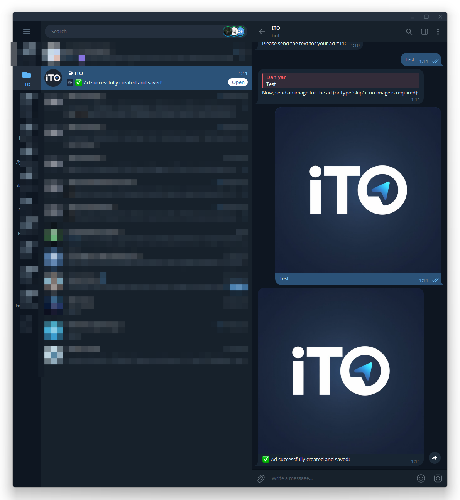

> Note: confirming in Telegram stores the content. You can additionally add a CTA button in the mini app and then save the ad.

## Step 9 — (Optional) Add a **button** to the ad
In the mini app, enable **Add a button to this ad**, enter **Button Text** and a **Button URL**.

- The URL must be a **valid, full** link with scheme: `https://example.com`.  
- If the format is wrong, you’ll see a validation error.

When the URL is valid, you can save:

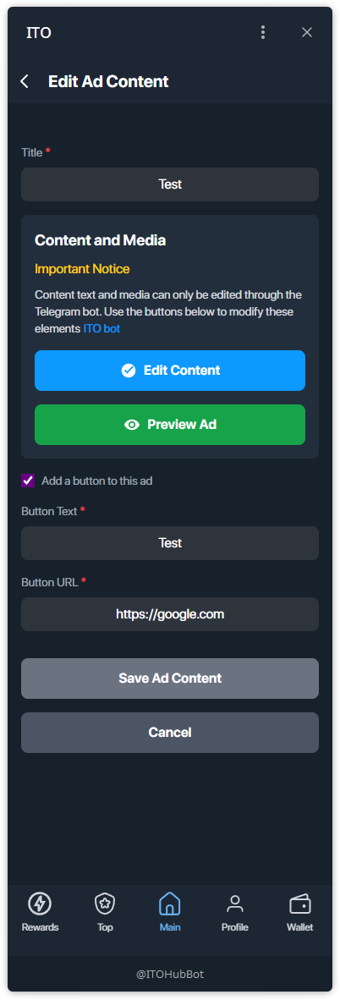

## Step 10 — Save & final check
Tap **Save Ad Content** in the mini app.  
In Telegram, you’ll see the final creative; if you added a button, it appears under the post:

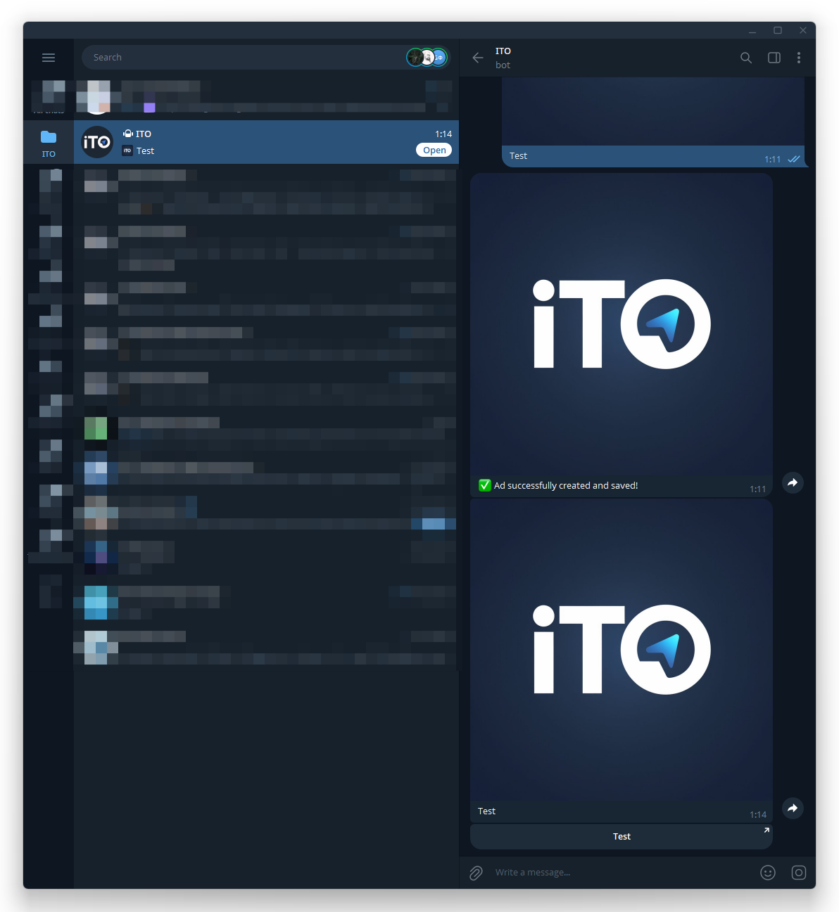

---

### Tips
- Keep titles short (internal use only).
- You can update the creative later via the same flow.
- The final message in Telegram is the exact rendering buyers will see.
