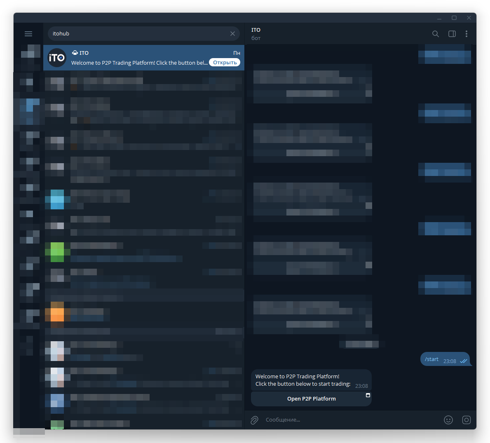

# Getting Started & Authentication / Начало работы и аутентификация

> **Target files:**
>
> • `en/user-guide/getting-started.md`
>
> • `ru/user-guide/getting-started.md`

---

## EN — Getting Started

### Step 1 — Launch the App

You can open the ITOhub Mini App in two ways:

1. **Direct link in Telegram** — tap the invitation/start link.
2. **Search in Telegram** — type `ITOHubBot` in the global search and open the verified bot. Press **Start**, then tap **Open App**.

### Step 2 — Automatic Authentication

* At first launch, the Mini App automatically authenticates you using your **Telegram account data (`initData`)**.
* Our backend verifies this signature and grants you secure access.

### Step 3 — Accept Rules

* Before using the app, you will be asked to **review and accept the platform rules**.
* This step ensures fair and safe deals for all participants.

### Step 4 — Connect TON Wallet

* To participate in deals, connect your **TON wallet**.
* Tap the **Wallet** icon in the bottom navigation bar.
* Connect via **TON Connect**.

