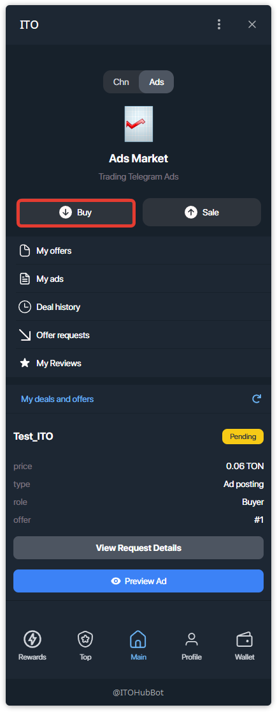
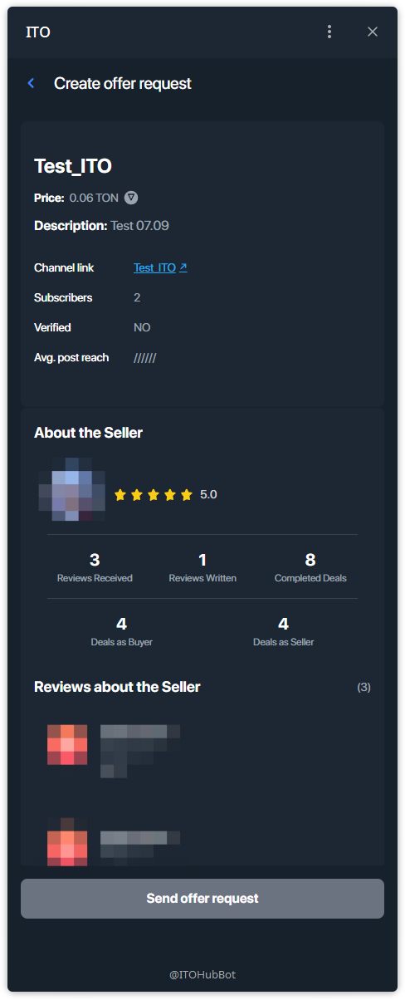
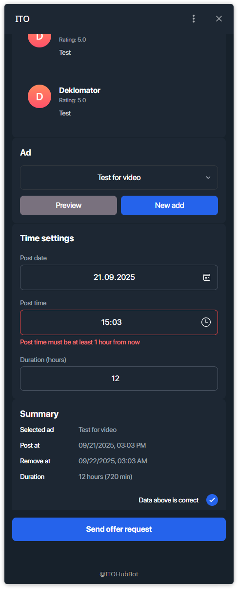
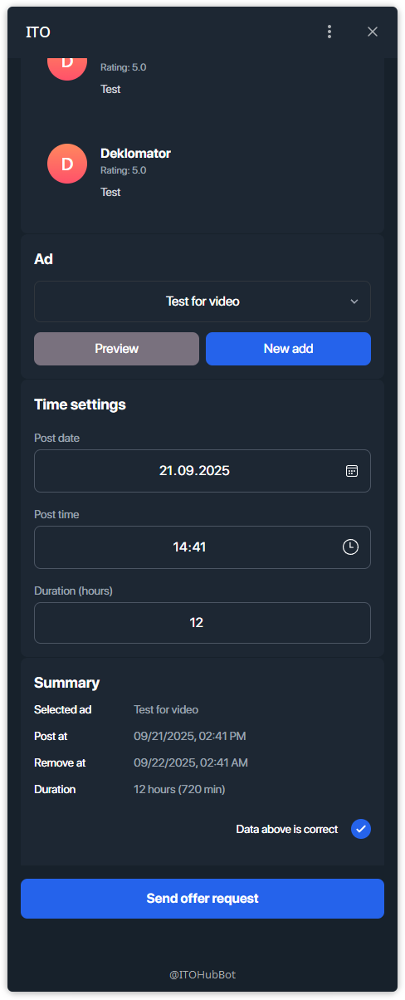

# How to Buy Ad?

This guide shows how to buy an ad posting using an **offer code**.

---

## Step 1 — Open **Buy** in Ads Market
On the main screen switch to **Ads** and tap **Buy**.

## Step 2 — Enter the Offer Code
Paste or type the **offer code** and press **Find offer**.

## Step 3 — Review Offer Details
Check the channel link, price in TON, description, subscribers, avg. reach, and seller’s rating & reviews.

## Step 4 — Choose Ad creative & set time
Select the ad creative (or create a new one), then set **Post date**, **Post time**, and **Duration (hours)**.

> Note: the **post time must be at least 1 hour from now**. If time is too close, you’ll see a validation message.

## Step 5 — Confirm data and send request
When the data is correct, check **Data above is correct** and tap **Send offer request**.

## Step 6 — Confirmation
You’ll see the confirmation screen: **Offer request was sent**.

