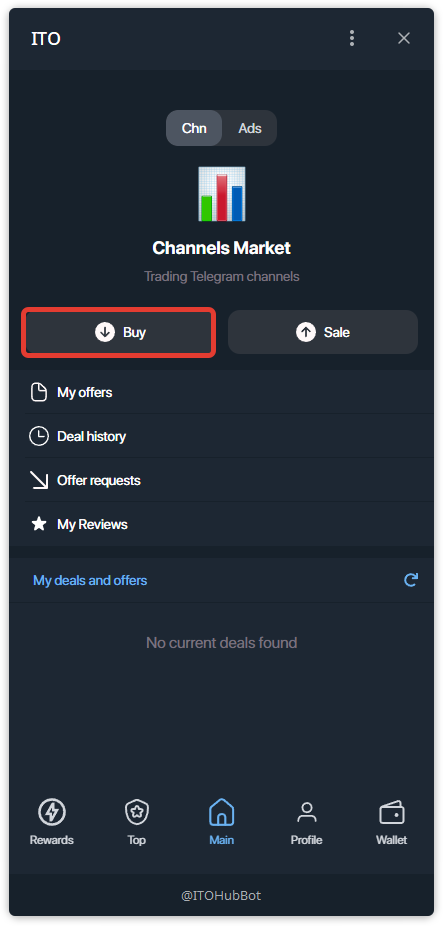
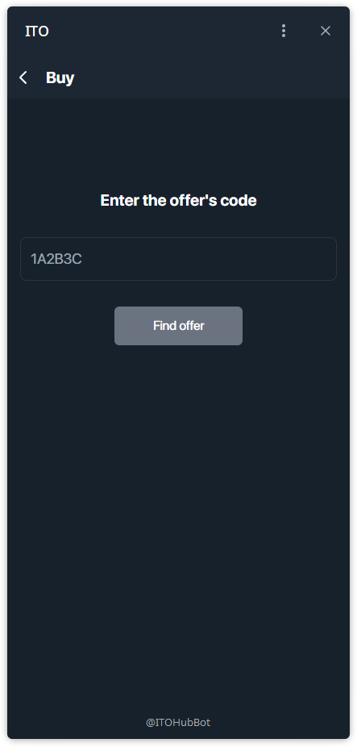
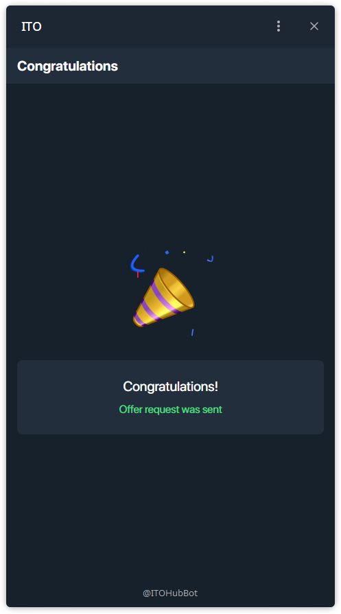

## EN — How to Buy

### Step 1 — Open Buy Menu
- On the main screen, tap **Buy**.

### Step 2 — Enter Offer Code
- You can purchase directly by entering the **offer code**.
- Type the code into the input field and tap **Find offer**.

### Step 3 — View Offer Details
- The system shows you all details: name, price in TON, description, subscribers, reach, seller rating and reviews.
- Carefully review the information before proceeding.

### Step 4 — Send Offer Request
- Tap **Send offer request** to initiate the deal.

### Step 5 — Confirmation
- You will see a confirmation screen once your request is sent successfully.

