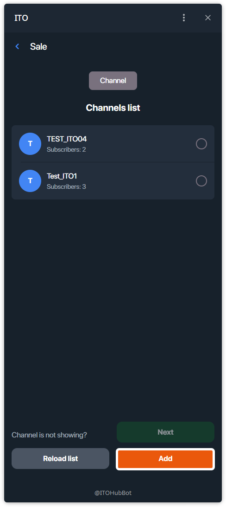

# How to Sell Ad?

This guide shows how to create an ad offer (ad slot) in your channel.

---

## Step 1 — Switch to Ads and tap **Sale**
On the main screen, switch to the **Ads** tab and press **Sale**.

## Step 2 — Open channel picker (if needed)
You’ll see your **Channels list**.  
If the channel isn’t shown, tap **Add** to open Telegram’s chat picker.

## Step 3 — Select the chat in Telegram
Choose the channel where you want to sell an ad slot.

## Step 4 — Select the channel and tap **Next**
After the channel appears in the list, select it (checkmark) and tap **Next**.

## Step 5 — Fill in the offer form and **Upload**
Set:
- **Deal name** (auto-filled from the channel),
- **Deal cost** + currency (**TON**),
- **Description**,
- Optional: **Has duration limit** and **Max. duration (hours)**, **Make public**.

Press **Upload**.

## Step 6 — Copy the generated code
The ad offer is created. Copy your **offer code** and share it with the buyer (or let buyers find it in TOP if public).

