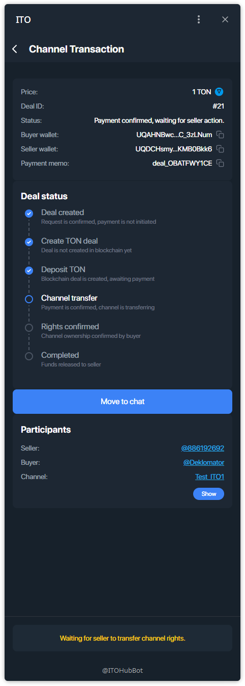
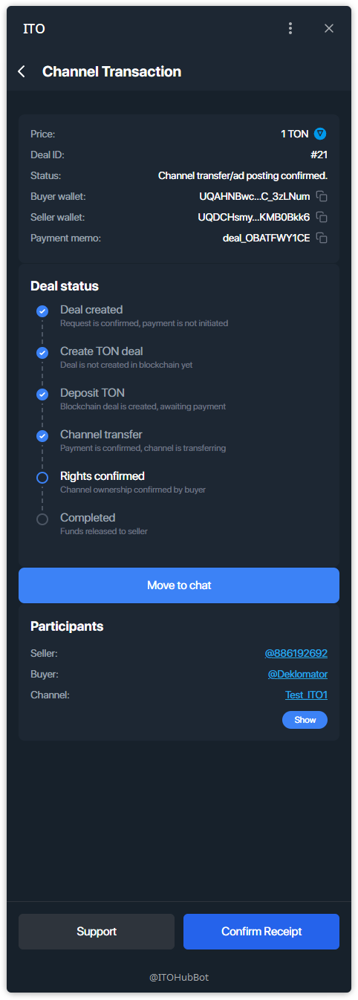

# Managing a Deal — Buyer (Channel)

This guide explains how to approve and complete a **channel sale** from the buyer’s side.

---

## Step 1 — Find your pending deal
Open **Main → My deals and offers**. Your deal is marked **Payment Pending**.

## Step 2 — Create blockchain deal
Open the deal card and tap **Create Blockchain Deal**.

## Step 3 — Fund escrow
Tap **Fund 1 TON** and confirm the payment via **TON Connect**. Funds will be locked in escrow.

## Step 4 — Wait for seller action
After payment the status changes to **Payment confirmed, waiting for seller action**.  
The seller must transfer channel ownership to you.

## Step 5 — Confirm receipt (release funds)
Once you have the channel ownership, tap **Confirm Receipt** to release escrow to the seller.

## Step 6 — Deal completed — leave a review
When escrow is released, the deal is completed. You can **Leave a Review**.

> Tip: use **Move to chat** in the deal card to coordinate transfer details.