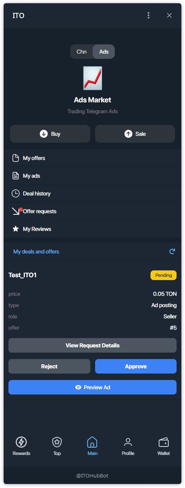
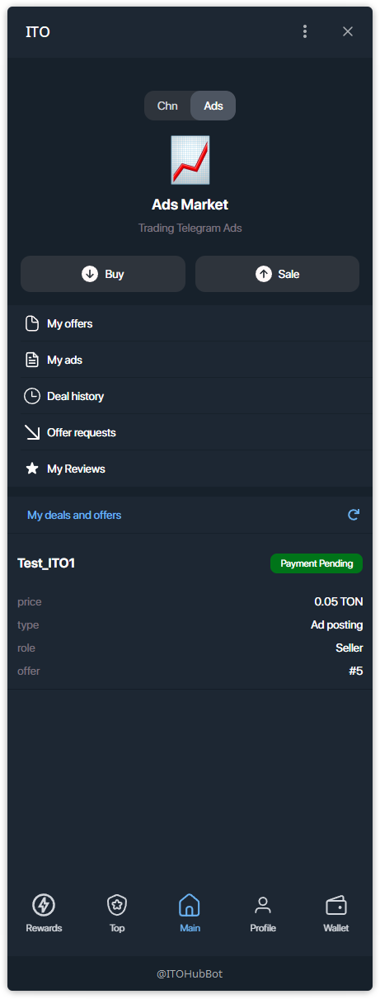
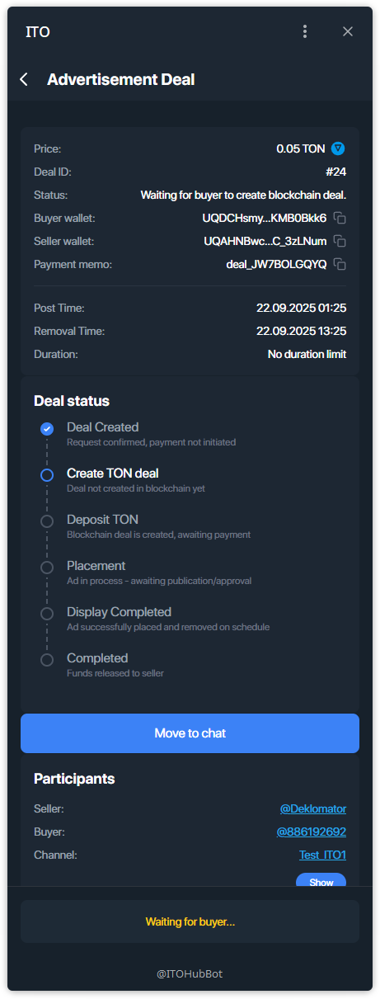
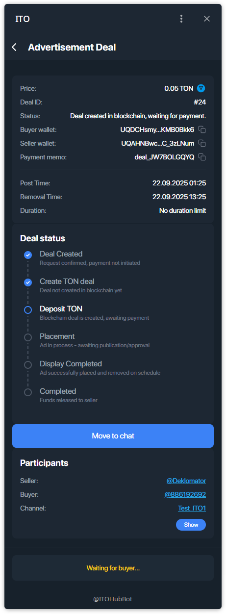
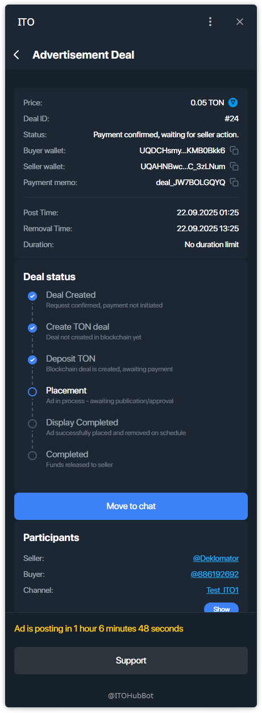
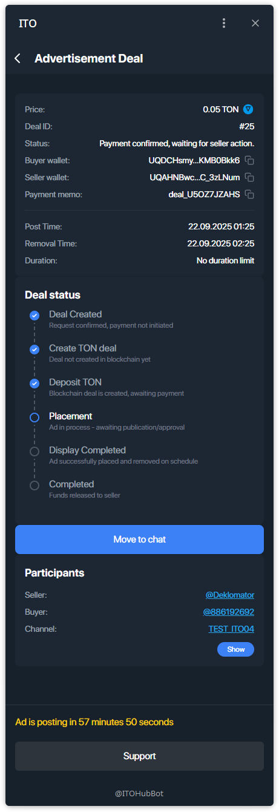
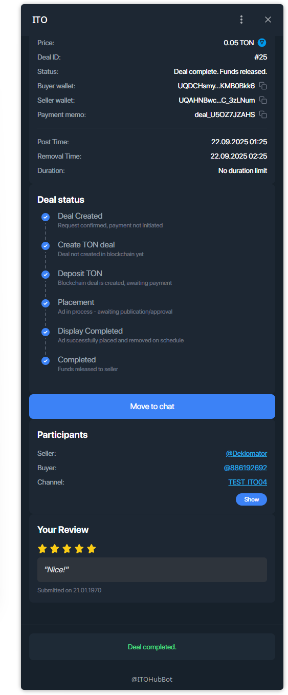
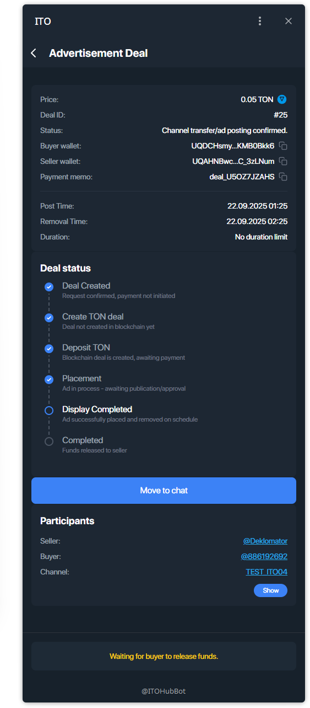
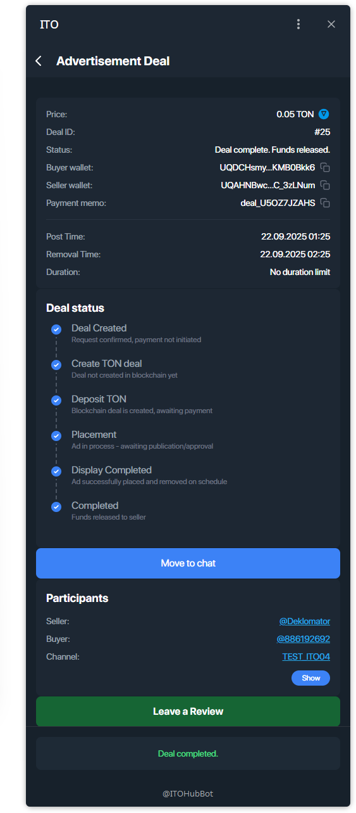

# Managing a Deal — Ads (Seller)

Walkthrough for a **seller** in an **Advertisement Deal**: approve request → wait for escrow → bot posts the ad automatically → funds released.

---

## Step 1 — Approve incoming request
Open **Main → My deals and offers**, then **Approve** (or **Reject**) the request.

After approval the card shows **Payment Pending**.

---

## Step 2 — Open deal details
Open **Advertisement Deal**. Initially you’ll see:
- **Waiting for buyer to create blockchain deal**  
- Then: **Deal created in blockchain, waiting for payment**

---

## Step 3 — Escrow funded → bot will post the ad automatically
When the buyer pays escrow, status changes to **Payment confirmed, waiting for seller action**.  
A countdown to posting time may appear.

**Important**
- The **ITO bot posts the ad automatically** at **Post Time** and **monitors** that it stays live until **Removal Time**.  
- No manual posting is required. Use **Move to chat** to coordinate details if needed.

---

## Step 4 — Display completed → waiting for release
After the posting window ends, the deal moves to **Display Completed**, then  
**Waiting for buyer to release funds**.

> If anything stalls, tap **Support** on the deal screen.

---

## Step 5 — Deal completed + review
Once the buyer releases funds, you’ll see **Deal complete. Funds released.**  
Leave a ★ rating and a short review for the buyer.

