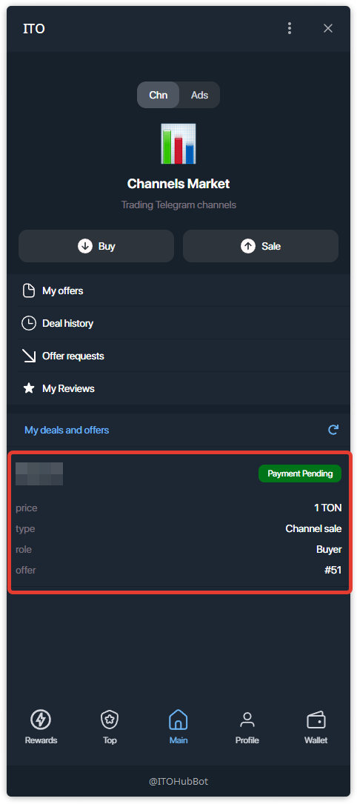

# Managing a Deal — Seller (Channel) / Управление сделкой — Продавец (Канал)

---

## EN — Seller flow (Channel)

### Step 1 — Approve buyer’s request
Open **Main → My deals and offers**. Find the request and tap **Approve**.

### Step 2 — Wait for buyer’s payment
The deal moves to **Payment Pending**. No action required from you yet.

### Step 3 — Track the deal timeline
Open the deal card. You’ll see the on-chain timeline:
- **Deal created**
- **Create TON deal** (blockchain deal is being created)
- **Deposit TON** (awaiting buyer’s payment)

Status now: **Waiting for buyer to create blockchain deal**.

### Step 4 — Buyer paid → your action required
After buyer funds escrow, status becomes **Payment confirmed, waiting for seller action**.

### Step 5 — Transfer channel rights in Telegram
In Telegram channel settings:
1) Add the buyer as admin (if needed).  
2) Transfer **channel ownership** to the buyer.  
Save changes.

### Step 6 — Confirm transfer in the deal
Return to the deal and press **I transferred channel** (or the respective button).  
Timeline will advance to **Rights confirmed** when the buyer verifies.

### Step 7 — Wait for buyer to release funds
After the buyer confirms ownership, the system prompts them to release escrow.

### Step 8 — Deal completed — leave a review
When funds are released, status becomes **Deal complete. Funds released.**  
Tap **Leave a Review** to rate the counterparty and add a comment.

### Step 9 — Review saved
Your review appears in the deal card.

> **Bot notifications:** You’ll also receive messages from the ITO bot about each key step (request, transfer confirmed, funds released).

# Managing a Deal — Buyer (Channel)

This guide explains how to approve and complete a **channel sale** from the buyer’s side.

---

## Step 1 — Find your pending deal
Open **Main → My deals and offers**. Your deal is marked **Payment Pending**.

## Step 2 — Create blockchain deal
Open the deal card and tap **Create Blockchain Deal**.

## Step 3 — Fund escrow
Tap **Fund 1 TON** and confirm the payment via **TON Connect**. Funds will be locked in escrow.

## Step 4 — Wait for seller action
After payment the status changes to **Payment confirmed, waiting for seller action**.  
The seller must transfer channel ownership to you.

## Step 5 — Confirm receipt (release funds)
Once you have the channel ownership, tap **Confirm Receipt** to release escrow to the seller.

## Step 6 — Deal completed — leave a review
When escrow is released, the deal is completed. You can **Leave a Review**.

> Tip: use **Move to chat** in the deal card to coordinate transfer details.

