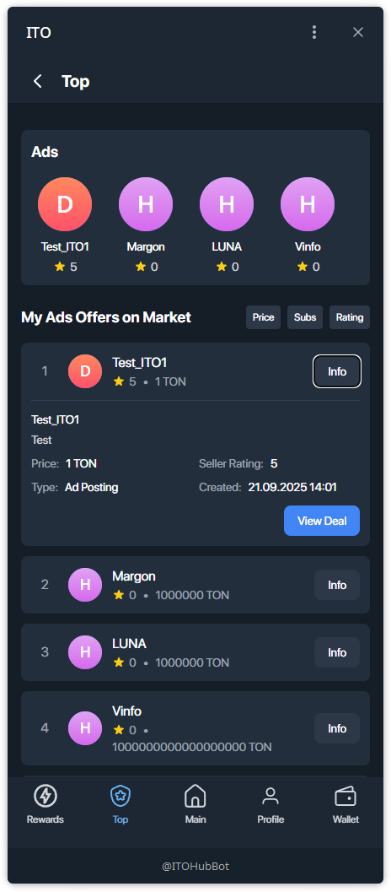
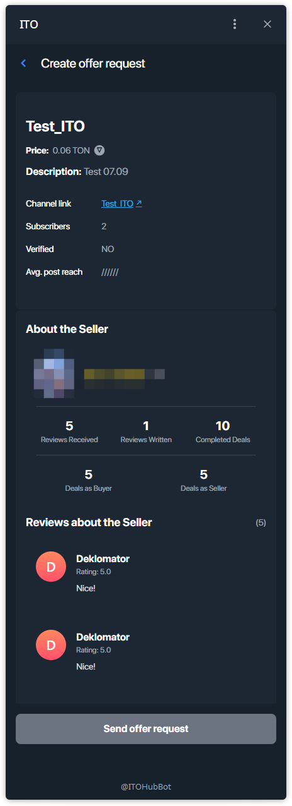

# Using TOP

Open the ranked market view to discover offers and jump into a deal.

## Step 1 — Open TOP
- Tap **Top** on the bottom navigation.
- You’ll see a featured **Ads** carousel on top and a ranked list **My Ads Offers on Market**.

**You can see:**
- Featured **Ads** carousel.
- Ranked list with positions (1, 2, 3…).
- Sort chips: **Price**, **Subs**, **Rating**.
- **Info** button on each card.

---

## Step 2 — Sort & Expand Info
- Use **Price / Subs / Rating** to reorder the list.
- Tap **Info** to expand a card with quick details (price, seller rating, created time) and **View Deal**.

> Tip: ranking helps compare offers quickly without opening each one.

---

## Step 3 — Open Offer Details → Send Request
- Tap **View Deal** to open full **Offer Details**: name, price (TON), description, channel link, subscribers, avg. reach, seller profile & reviews.
- Press **Send offer request** to start the purchase flow.

> Next steps: fund escrow via TON Connect, wait for the seller’s action, then complete the deal.
