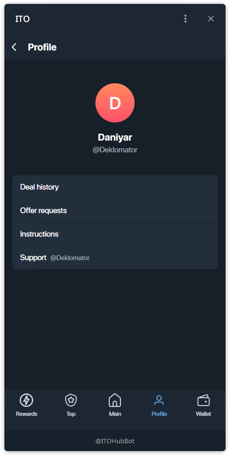
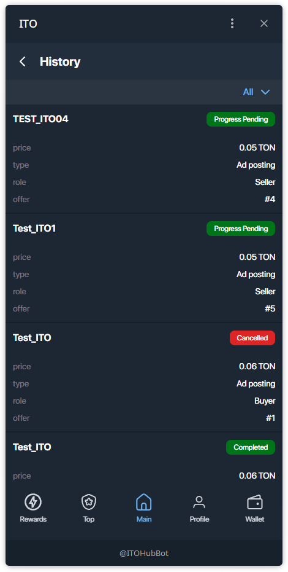
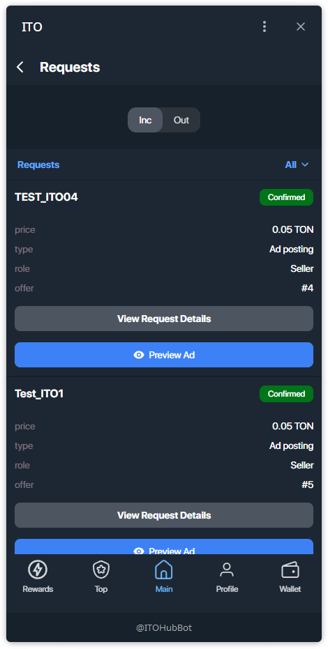
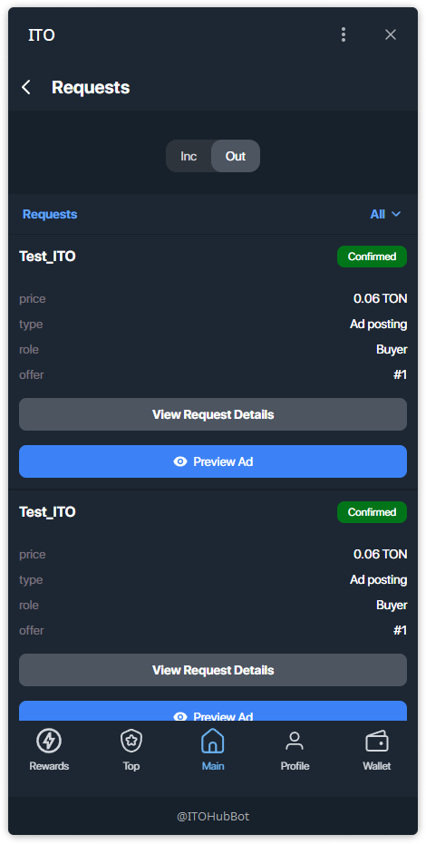

# Your Profile and History

The "Profile" screen is your personal account within the application. It contains your main information and provides access to important sections.

### Main Information

# Your Profile and History

Open your profile from the bottom nav.

## Sections
- **Deal history** — full list of your deals with statuses.
- **Offer requests** — incoming/outgoing requests tied to your offers and purchases.
- **Instructions** — quick docs/help.
- **Support** — direct contact.

---

## Deal history
Each item shows **price**, **type** (Channel sale / Ad posting), your **role** (Buyer / Seller), and **offer ID**.

**Status badges:**
- **Progress Pending** — the flow is active; wait for the next step.
- **Completed** — finished successfully.
- **Cancelled** — deal was cancelled.

---

## Offer requests
Switch **Inc / Out** to see **Incoming** (requests to you) or **Outgoing** (requests you sent).

**Incoming (Inc):**

**Outgoing (Out):**

> Tip: a **Confirmed** label means the other side accepted; proceed with the next step of the deal.
