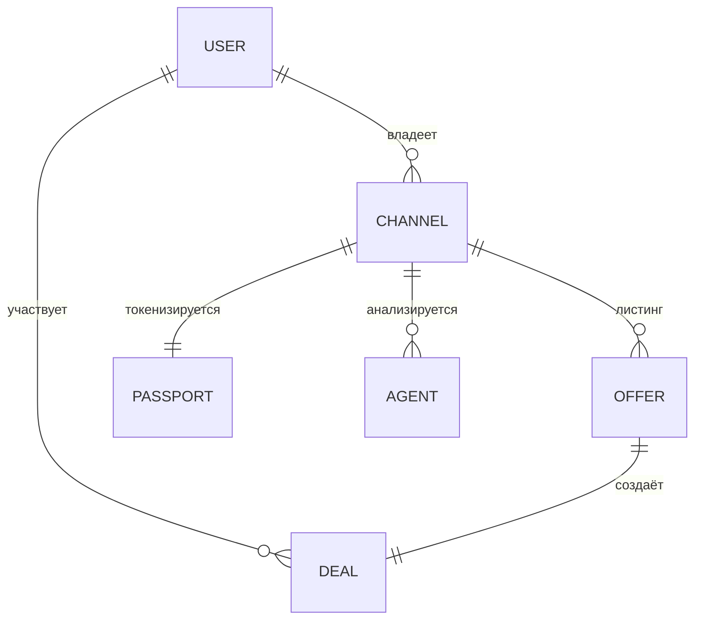

## RU — Модель данных

### Основные сущности

| Сущность               | Символ | Описание                                                                       |
| ---------------------- | ------ | ------------------------------------------------------------------------------ |
| **User (Польз.)**      | `U`    | Аккаунт Telegram в ITOhub. Хранит кошелёк, рейтинг, историю.                   |
| **Channel (Канал)**    | `C`    | Цифровой актив (канал в Telegram). Метрики, владелец, статус продажи.          |
| **Offer (Оффер)**      | `O`    | Листинг сделки (продажа канала или реклама). Цена, код, статус.                |
| **Deal (Сделка)**      | `D`    | Экземпляр эскроу-контракта. Связывает продавца и покупателя, блокирует TON.    |
| **Passport (Паспорт)** | `P`    | Token Passport — TIP‑3 токен с метаданными (владение, история, метрики).       |
| **Agent (Агент)**      | `A`    | Swarm Agent, привязанный к каналу. Сбор метрик, рекомендации, DAO‑голосования. |

### Связи

* `U` ↔ `C` — Пользователь владеет одним или несколькими каналами.
* `C` → `O` — У канала может быть один активный публичный оффер.
* `O` → `D` — При акцепте оффер становится сделкой.
* `D` блокирует средства в TON до завершения.
* `C` ↔ `P` — Канал может быть токенизирован через Паспорт.
* `A` ↔ `C` — У каждого канала может работать собственный Swarm Agent.

### Состояния

* **Offer (Оффер)** → `draft` (черновик) → `active` (активен) → `accepted` (принят) → `closed/cancelled` (закрыт/отменён)
* **Deal (Сделка)** → `pending_payment` (ожидает оплаты) → `funded` (заблокированы средства) → `resolved` (завершена) / `disputed` (спор)
* **Passport (Паспорт)** → `issued` (выпущен) → `active` (активен) → `burned` (сожжён)
