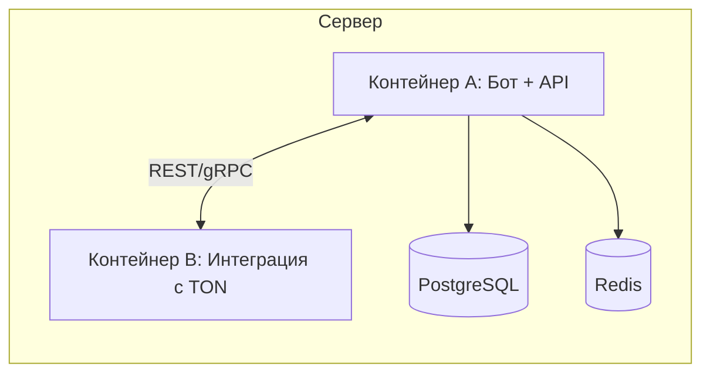

## RU — Обзор системы

### Назначение

**ITOhub** — Web3‑платформа на базе **TON** для **безопасных P2P‑сделок внутри Telegram**. Обеспечивает надёжную передачу прав на каналы и рекламные слоты через **эскроу на смарт‑контрактах**, сохраняя весь пользовательский путь в **Mini App и боте**.

### Архитектура (верхний уровень)

* **Telegram Mini App и бот** — интерфейс пользователя: офферы, сделки, платежи, события.
* **Backend‑сервис (FastAPI, в Docker)** — бизнес‑логика, аутентификация, сессии, валидации.
* **Слой БД** — **PostgreSQL** (пользователи, каналы, офферы, сделки), **Redis** (сессии, кэш, rate‑limits).
* **Смарт‑контракты TON** — эскроу (fund, lock, resolve, распределение комиссии протокола).
* **CI/CD** — GitHub Actions (тесты, сборка, деплой).

```mermaid
flowchart TB
  U[Пользователь в Telegram] --> M[Telegram Mini App & Бот]
  M --> API[Backend API (FastAPI)]
  API --> DB[(PostgreSQL)]
  API --> REDIS[(Redis)]
  API <--> TON[Смарт‑контракты TON (Escrow)]
  CI[CI/CD (GitHub Actions)] --> API
```

### Модель развёртывания (MVP)

* **Один сервер** с Docker:

  * **Контейнер A:** Бот + API + (опционально) БД.
  * **Контейнер B:** Модуль интеграции с TON (SDK / light client).
* Взаимодействие по **внутренней сети Docker** (REST/gRPC).
* **Дальше:** переход к **Kubernetes** для горизонтального масштабирования и выноса DB/Redis на отдельные узлы.



### Принципы безопасности и доверия

* **Эскроу на блокчейне** исключает риск мошенничества.
* **JWT‑аутентификация через Telegram WebApp** (подписанные `initData`).
* **TLS** для всех API‑эндпоинтов.
* **Антифрод (план):** детекция аномалий, лимиты действий, репутация/риск‑скоринг.

### Ключевые сценарии (happy‑path)

1. **Создание оффера** (продажа канала / размещение рекламы) в Mini App.
2. **Вход в сделку** (публичный список или по **коду оффера**).
3. **Фандинг эскроу** в **TON**; средства блокируются.
4. **Действие продавца** (передача прав/размещение рекламы).
5. **Завершение** → эскроу выплачивает; удерживается **комиссия 3%**; газ — на блокчейне.
6. **Диспут** (при необходимости) → политика DAO/арбитра (после MVP).
