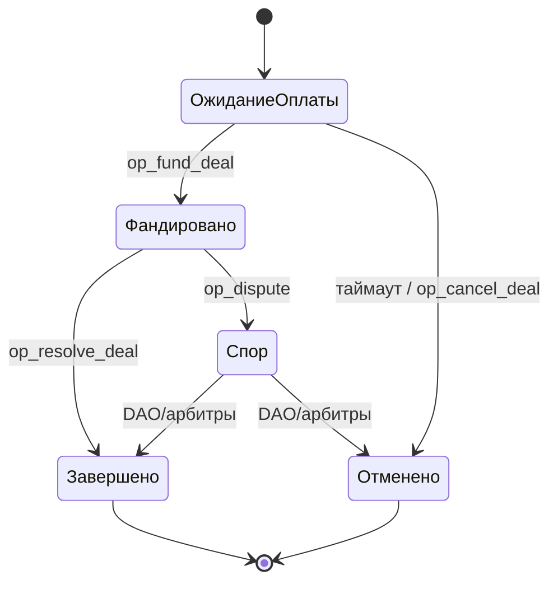

## RU — Обзор смарт-контракта

### Назначение

**Смарт-контракт ITOhub** управляет **эскроу-сделками P2P** в блокчейне TON. Он гарантирует, что средства покупателя будут заблокированы до выполнения продавцом обязательств (передача канала, размещение рекламы, аренда бота и т.п.).

### Основные функции

* **Создание сделки** (`op_create_deal`) — инициализация эскроу: ID сторон, актив, сумма.
* **Фандинг сделки** (`op_fund_deal`) — покупатель блокирует средства в TON; сделка переходит в состояние *funded*.
* **Завершение сделки** (`op_resolve_deal`) — при успешном завершении средства переводятся продавцу минус комиссия протокола.
* **Отмена сделки** (`op_cancel_deal`) — если нет оплаты в течение таймаута или по обоюдному согласию до фандинга.
* **Спор** (`op_dispute`) — опционально, передача на DAO/арбитров (будущий этап).

### Машина состояний

### Комиссии

* **Комиссия протокола:** фиксированные 3% с каждой сделки.
* **Gas:** \~0.02 TON за транзакцию (оплачивается на блокчейне).
* Будущие расширения: доля рефералу, распределение в казну/сжигание.

### Безопасность

* Неизменяемый контракт в TON.
* Таймауты предотвращают зависание средств.
* Все переходы состояния логируются на блокчейне.
* Механизм спора рассчитан на DAO/арбитров.
