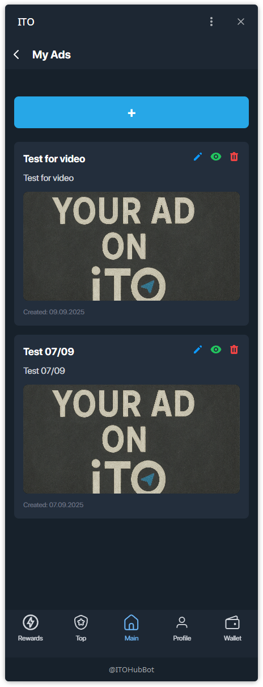
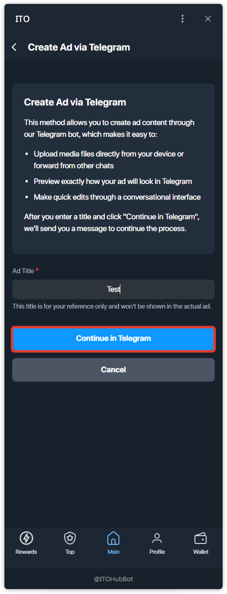
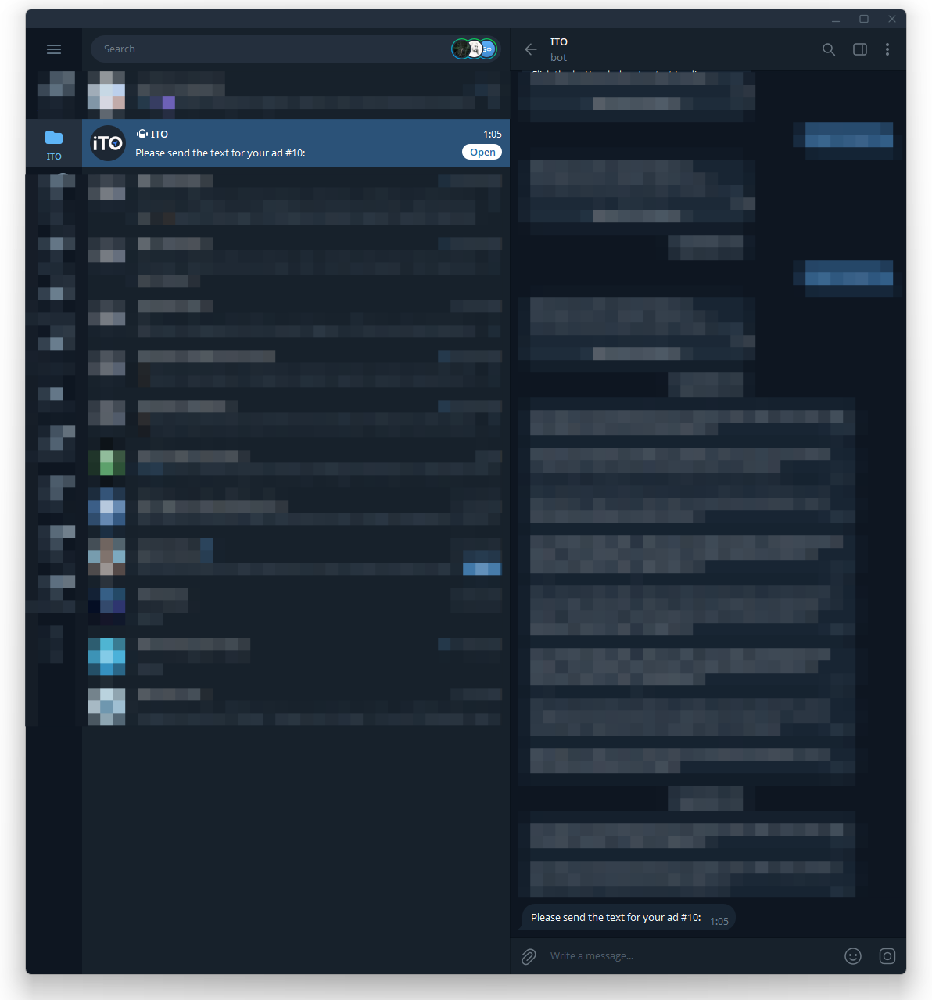
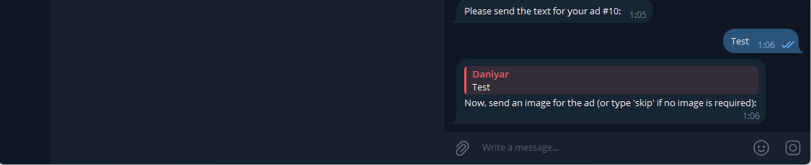
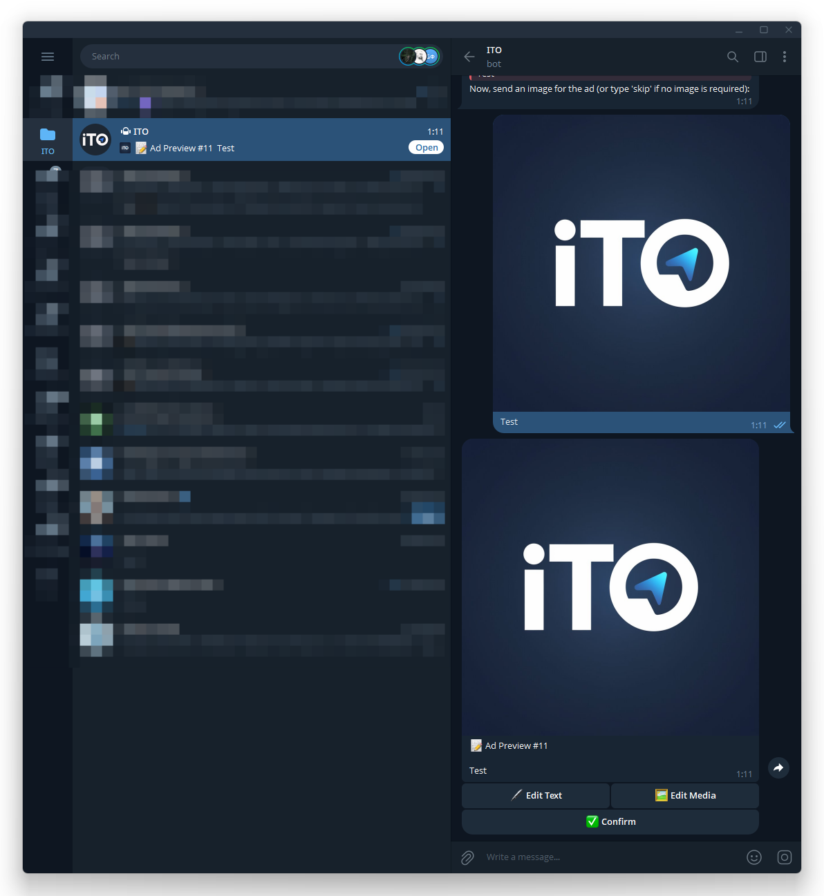

# Управление рекламными постами (Ad-креативы)

Создавайте и редактируйте **рекламный пост Telegram** через бота ITO.  
Весь контент (текст/медиа) передаётся в Telegram, а итоговый превью показывает, как пост будет выглядеть на самом деле.

---

## Шаг 1 — Открыть **My ads**
На главном экране нажмите **My ads**.

## Шаг 2 — Список My Ads
Здесь управляются все ваши креативы. Нажмите **+**, чтобы создать новый.

## Шаг 3 — Создание через Telegram
Выберите способ **Create Ad via Telegram**.  
Редактирование будет идти через бота: загрузка медиа, пересылка из других чатов, мгновенный превью.

## Шаг 4 — Укажите заголовок → Continue in Telegram
Введите короткий внутренний заголовок и нажмите **Continue in Telegram**.

## Шаг 5 — Экран **Edit Ad Content** (в mini app)
В мини-приложении появится карточка **Edit Ad Content**.  
Важно: **текст и медиа редактируются только через Telegram-бота**; используйте кнопки для перехода.

## Шаг 6 — Отправьте **текст** объявления в Telegram
Бот попросит: «Please send the text for your ad #…».  
Ответьте нужным текстом поста.

## Шаг 7 — Отправьте **изображение** (по желанию)
Если в посте нужна картинка — пришлите её боту. Если нет — напишите `skip`.

## Шаг 8 — **Превью и подтверждение** в Telegram
Бот пришлёт **Ad Preview** с кнопками:
- **Edit Text** — изменить текст,
- **Edit Media** — изменить картинку,
- **Confirm** — подтвердить креатив.

## Шаг 9 — Сохраните креатив в мини-приложении
Вернитесь в **My ads** → откройте креатив → **Preview Ad** (по желанию) → **Save Ad Content**.  
Креатив готов — его можно использовать в сделках и офферах.

---

### Подсказки
- Заголовок — только для вас, делайте коротким и понятным.
- Креатив всегда можно отредактировать тем же способом.
- Превью от бота — это точное отображение поста для покупателей.
