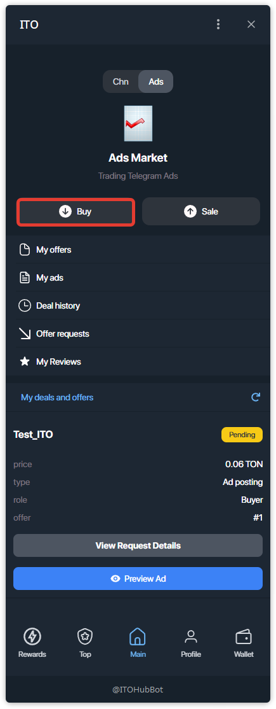
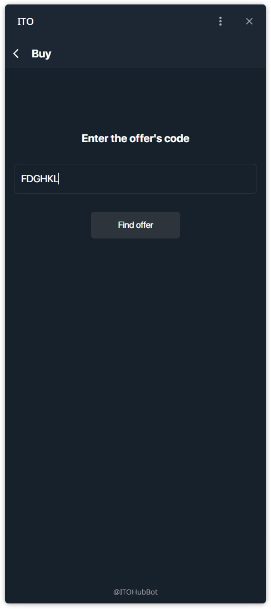
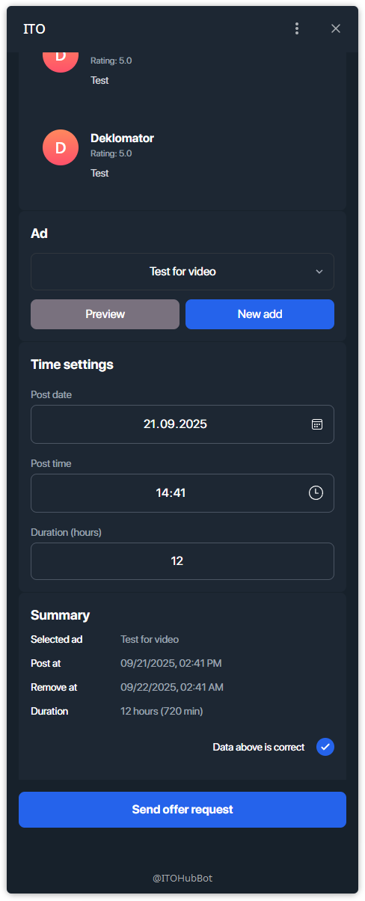
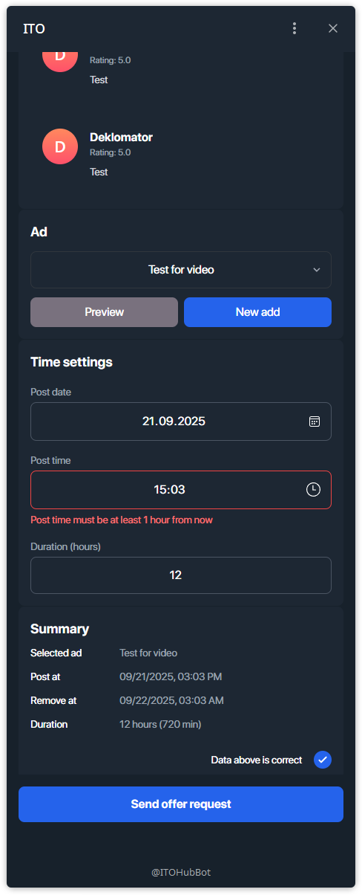
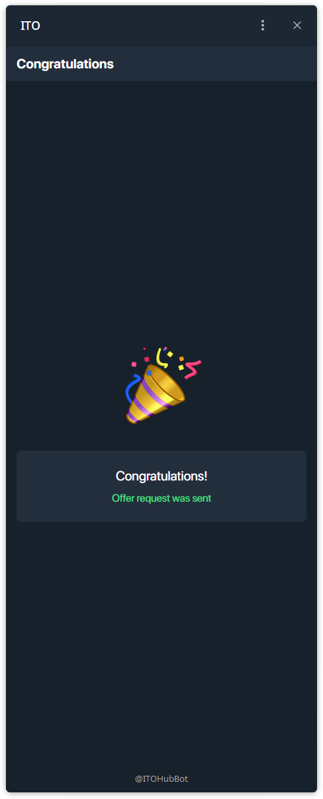

# Как купить рекламу?

Ниже — пошаговая инструкция покупки рекламного размещения по **коду оффера**.

---

## Шаг 1 — Откройте **Buy** в Ads Market
На главном экране переключитесь на **Ads** и нажмите **Buy**.

## Шаг 2 — Введите код оффера
Вставьте или введите **код оффера** и нажмите **Find offer**.

## Шаг 3 — Проверьте детали оффера
Проверьте ссылку на канал, цену в TON, описание, число подписчиков, средний охват и рейтинг/отзывы продавца.

## Шаг 4 — Выберите креатив и задайте время
Выберите креатив (или создайте новый), затем укажите **дату публикации**, **время** и **длительность (часов)**.

> Важно: **время публикации должно быть не меньше чем через 1 час**. Иначе появится предупреждение.

## Шаг 5 — Подтвердите и отправьте запрос
Отметьте чекбокс **Data above is correct** и нажмите **Send offer request**.

## Шаг 6 — Подтверждение
Появится экран с сообщением **Offer request was sent**.

