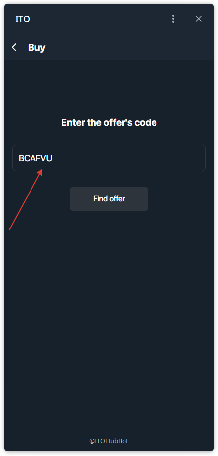
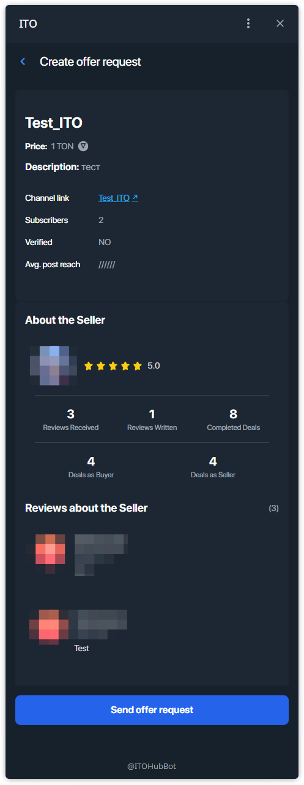

## RU — Как купить Канал.

### Шаг 1 — Открыть меню «Купить»
- На главном экране нажмите **Buy**.

### Шаг 2 — Ввести код оффера
- Покупку можно совершить напрямую, введя **код оффера**.
- Введите код в поле и нажмите **Find offer**.

### Шаг 3 — Просмотр деталей оффера
- Система покажет всю информацию: название, цену в TON, описание, число подписчиков, охват, рейтинг и отзывы о продавце.
- Внимательно ознакомьтесь с деталями.

### Шаг 4 — Отправить запрос
- Нажмите **Send offer request**, чтобы инициировать сделку.

### Шаг 5 — Подтверждение
- После успешной отправки появится экран подтверждения.

