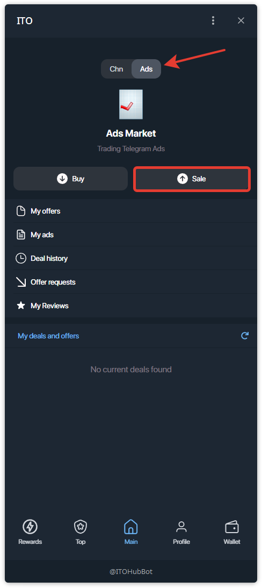
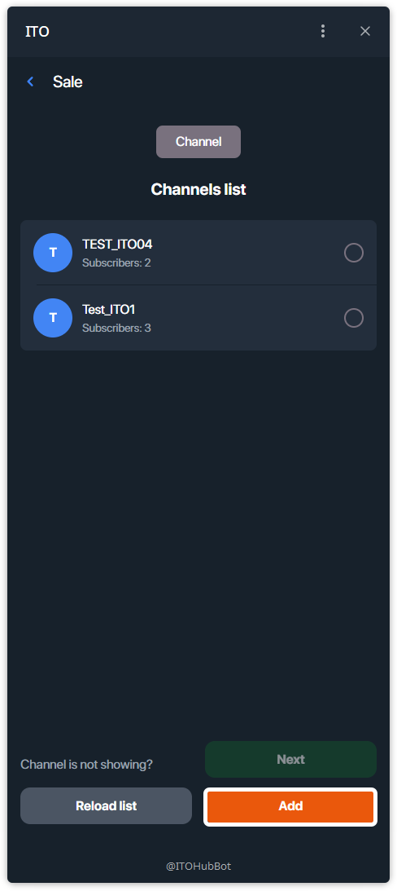
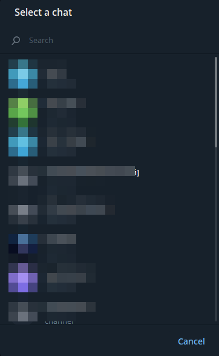
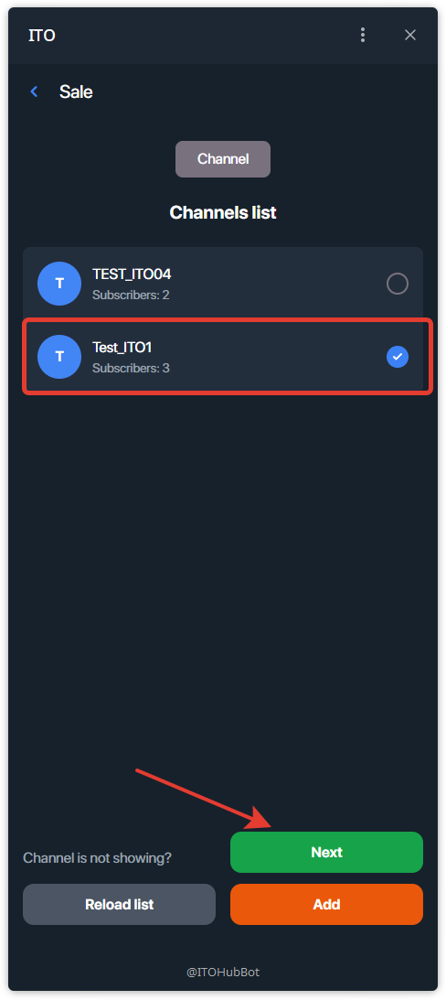
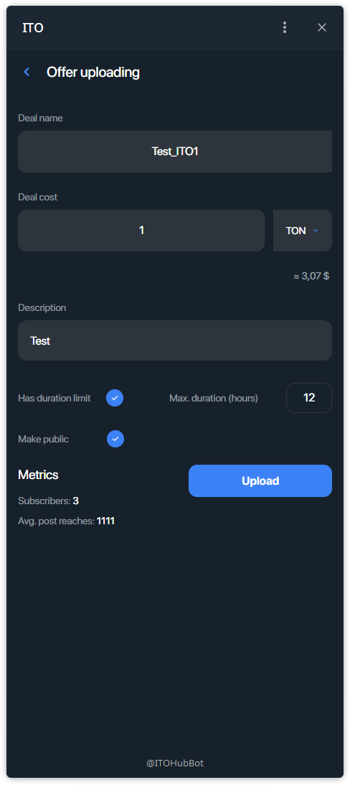
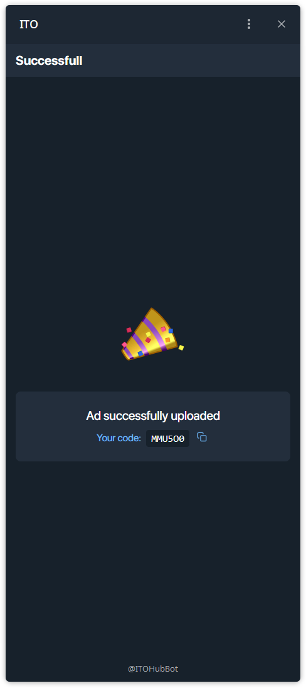

# Как продать рекламу?

Ниже — пошаговая инструкция по созданию рекламного оффера (слота) в вашем канале.

---

## Шаг 1 — Перейдите в **Ads** и нажмите **Sale**
На главном экране переключитесь на вкладку **Ads** и нажмите **Sale**.

## Шаг 2 — Откройте выбор канала (при необходимости)
Откроется **список каналов**.  
Если нужного канала нет в списке, нажмите **Add**, чтобы открыть выбор чатов Telegram.

## Шаг 3 — Выберите канал в Telegram
Укажите канал, в котором вы продаёте рекламный слот.

## Шаг 4 — Отметьте канал и нажмите **Next**
Когда канал появится в списке, выберите его (галочка) и нажмите **Next**.

## Шаг 5 — Заполните форму оффера и нажмите **Upload**
Укажите:
- **Deal name** (подставляется автоматически),
- **Deal cost** и валюту (**TON**),
- **Description**,
- Опционально: **Has duration limit** и **Max. duration (hours)**, **Make public**.

Нажмите **Upload**.

## Шаг 6 — Скопируйте сгенерированный код
Оффер создан. Скопируйте **код оффера** и отправьте его покупателю (или оставьте оффер публичным в TOP).

