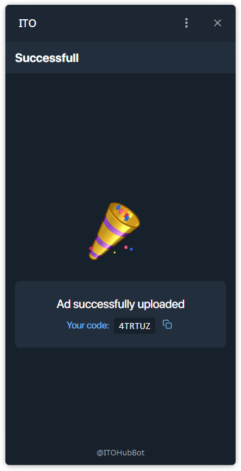

## RU — Как продать Канал.

### Шаг 1 — Перейти в раздел Sale

* На главном экране нажмите **Sale**.

### Шаг 2 — Выбрать канал или группу

* Выберите, что хотите продать: **канал** или **группу**.
* Появится список доступных каналов.

### Шаг 3 — Добавить канал, если не отображается

* Если канал не отображается, нажмите **Add**.
* Выберите нужный канал из списка чатов Telegram.

### Шаг 4 — Подтвердить канал

* Когда канал появился, выберите его и нажмите **Next**.

### Шаг 5 — Заполнить оффер

* Укажите **название сделки**.
* Задайте **цену** в TON.
* Добавьте **описание**.
* Отметьте, будет ли оффер **публичным**.
* Метрики (подписчики, охваты) подтягиваются автоматически.

### Шаг 6 — Успешная публикация и код оффера

* После загрузки система покажет подтверждение и сгенерирует уникальный **код оффера**.

