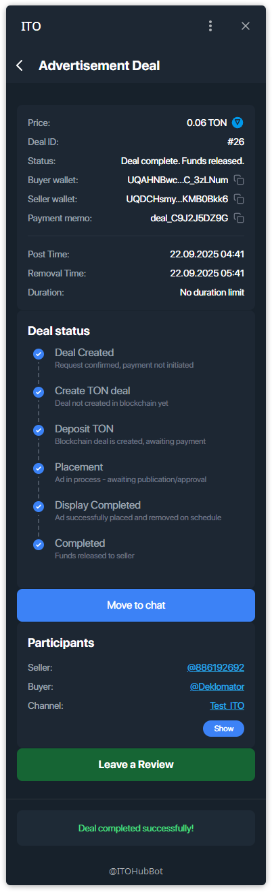
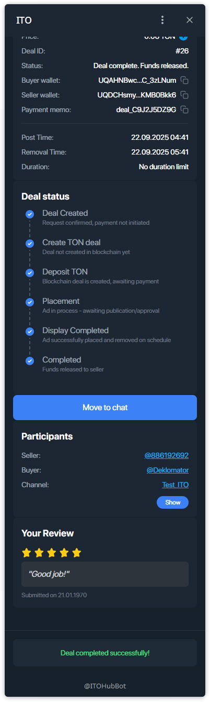

# Управление сделкой — Реклама (покупатель)

Как **покупателю** пройти рекламную сделку: найти оффер → выбрать креатив и время → дождаться одобрения → создать сделку в блокчейне → оплатить эскроу → бот публикует → выпустить средства.

---

## Шаг 1 — Открыть **Buy**
На главном экране нажмите **Buy**.

---

## Шаг 2 — Ввести код оффера
Вставьте полученный **код оффера** и нажмите **Find offer**.

---

## Шаг 3 — Проверить оффер и продавца
Проверьте цену, ссылку на канал, число подписчиков, верификацию, рейтинг и отзывы продавца.

---

## Шаг 4 — Выбрать **креатив** и расписание
Выберите свой **Ad-креатив** (подготовьте заранее через [Ad Creatives](./ad-creatives.md)), задайте:
- **Дату публикации**
- **Время публикации**
- **Длительность (часы)**
- Отметьте **Data above is correct**.

Нажмите **Send offer request**.

---

## Шаг 5 — Ожидать одобрения продавца
На карточке сделки будет статус **Pending**, пока продавец не подтвердит.

---

## Шаг 6 — Payment Pending → открыть сделку
После одобрения появится **Payment Pending** — откройте карточку.

---

## Шаг 7 — Создать сделку в блокчейне
Нажмите **Create Blockchain Deal**.

---

## Шаг 8 — Оплатить эскроу
Нажмите **Fund … TON** и подтвердите транзакцию в вашем TON-кошельке.

---

## Шаг 9 — Платёж подтверждён
Статус сменится на **Payment confirmed, waiting for seller action**.  
> **Бот ITO** автоматически **опубликует пост** в момент **Post Time** и будет **мониторить его наличие** до **Removal Time**.

---

## Шаг 10 — Выпустить средства и оставить отзыв
Когда показ завершён и пост снят по расписанию, **выпустите средства**, чтобы завершить сделку.  
Затем нажмите **Leave a Review**, поставьте ★-оценку и напишите короткий комментарий.

---

### Примечания
- Если оплата не проходит: проверьте подключение кошелька, баланс и комиссию сети.  
- Ошиблись со временем — отмените запрос и создайте новый.  
- При проблемах воспользуйтесь кнопкой **Support** на экране сделки или **Move to chat** для координации.
