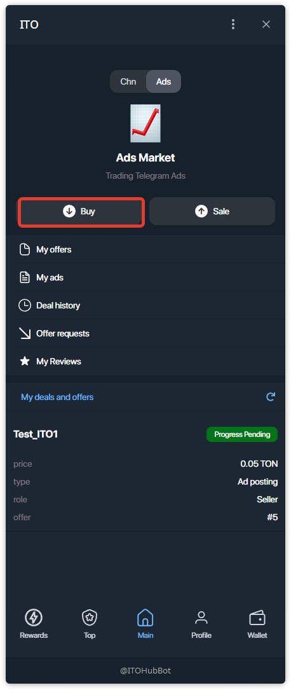
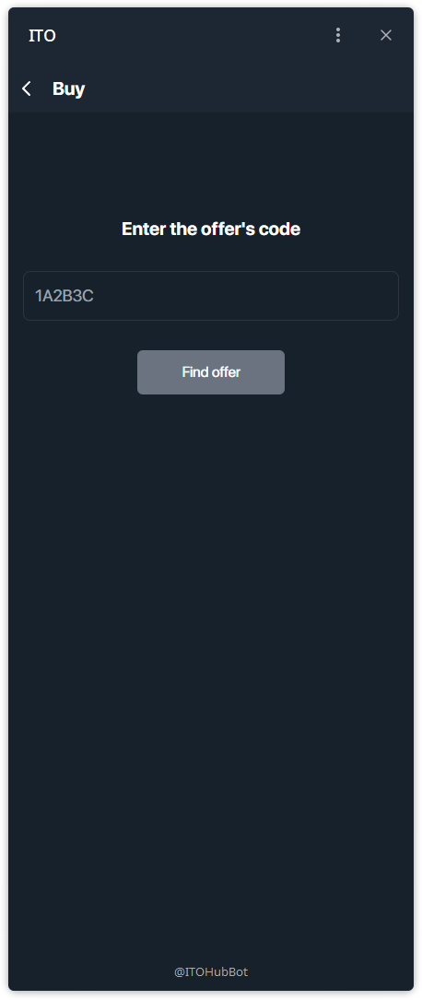
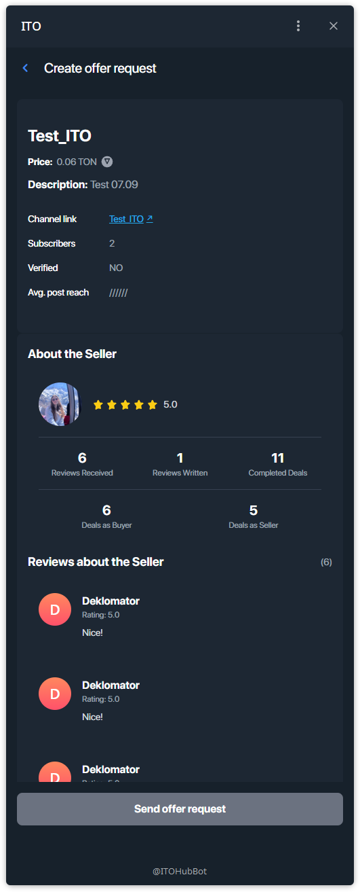
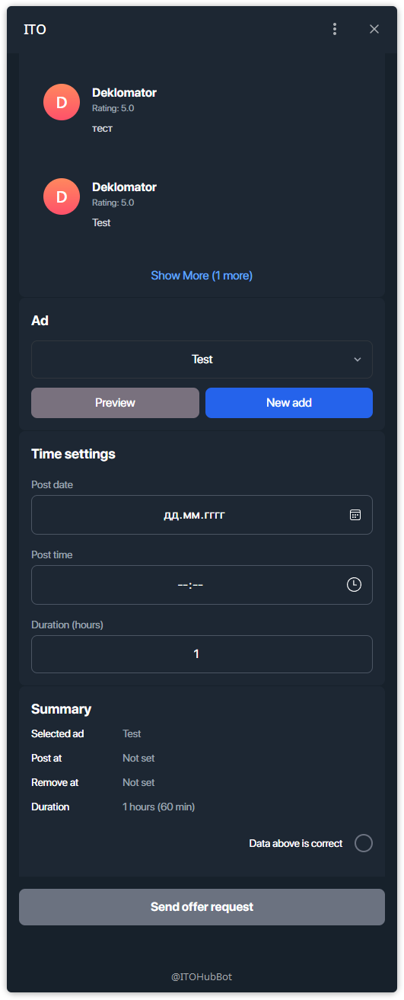
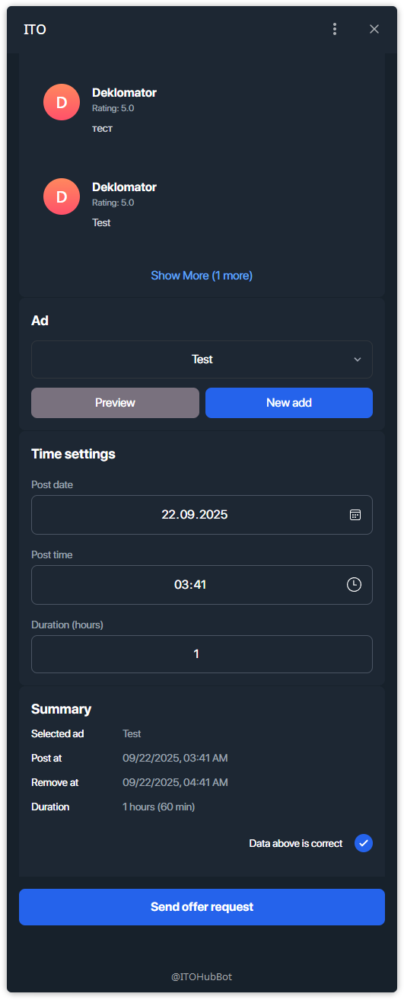
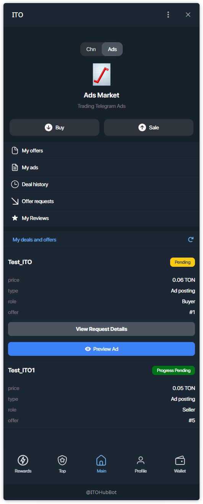
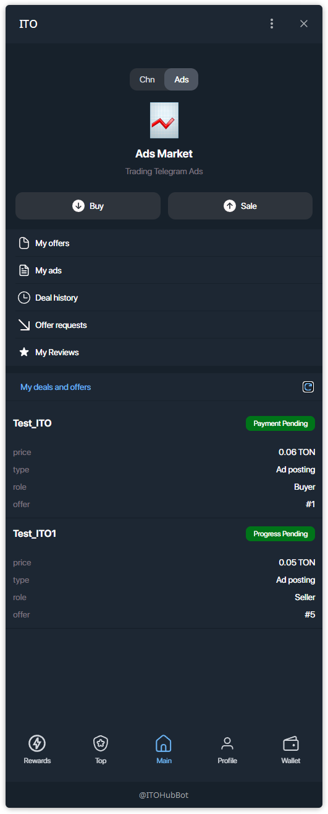
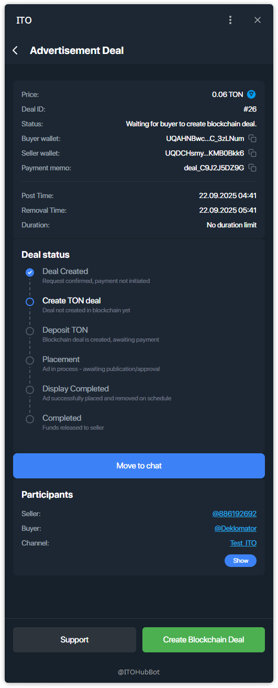
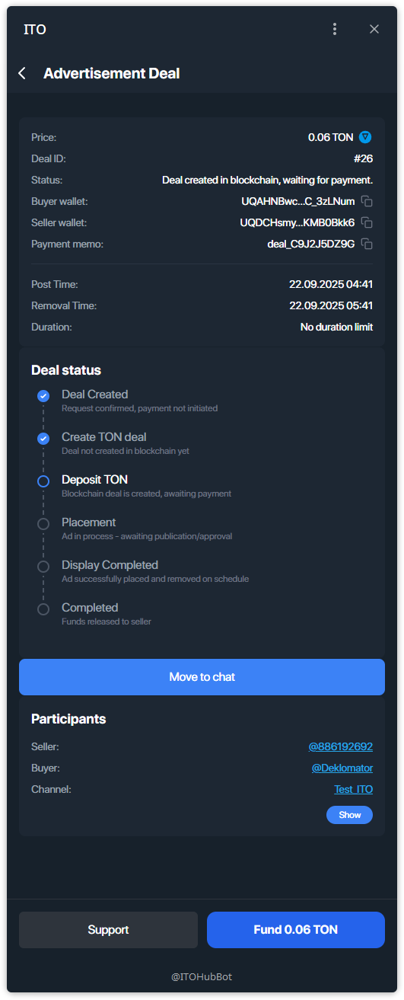
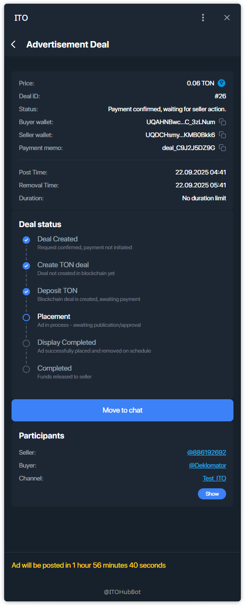

# Managing a Deal — Ads (Buyer)

How a **buyer** completes an **Advertisement Deal**: find offer → set ad & schedule → wait for seller approval → create blockchain deal → fund escrow → bot posts → release funds.

---

## Step 1 — Open **Buy**
From the main screen, tap **Buy**.

## Step 2 — Enter the offer code
Paste the **offer code** you received and tap **Find offer**.

## Step 3 — Review the offer & seller
Check price, channel, subscribers, and seller’s rating & reviews.

## Step 4 — Choose your **Ad** and schedule
Pick your **Ad creative** (you can prepare it in advance via [Ad Creatives](./ad-creatives.md)), then set:
- **Post date**
- **Post time**
- **Duration (hours)**
- Confirm with **Data above is correct**.

Tap **Send offer request**.

## Step 5 — Wait for seller’s approval
Your deal card shows **Pending** until the seller approves.

## Step 6 — Payment Pending → open the deal
After approval the card shows **Payment Pending** — open it.

## Step 7 — Create blockchain deal
Tap **Create Blockchain Deal**.

## Step 8 — Fund escrow
Tap **Fund … TON** and confirm the transfer from your TON wallet.

## Step 9 — Payment confirmed
Status changes to **Payment confirmed, waiting for seller action**.  
> The **ITO bot** will post the ad automatically at the scheduled **Post Time** and will monitor it until **Removal Time**.

## Step 10 — Release funds & review
When the ad has been displayed and removed on schedule, **release funds** to finish the deal, then leave a ★ rating and short review.

---

### Notes
- If funding fails: check wallet connection, balance, and network fees.  
- If the schedule is wrong — cancel the request and create a new one.  
- For any blockers, use **Support** on the deal screen.
