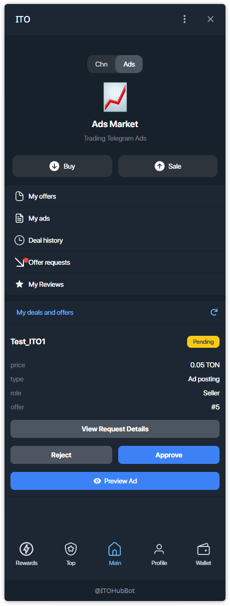
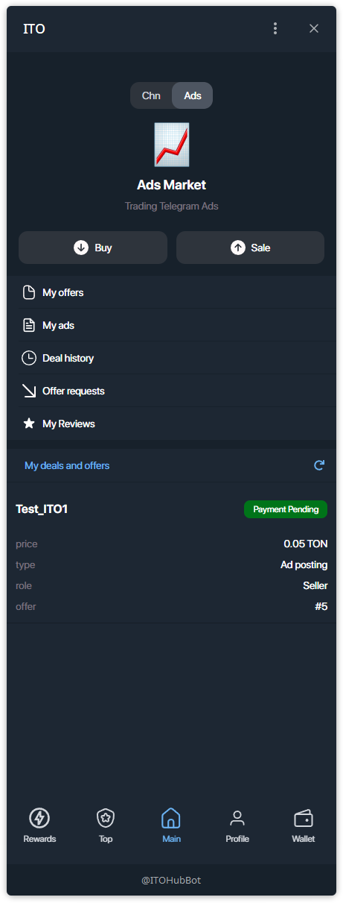
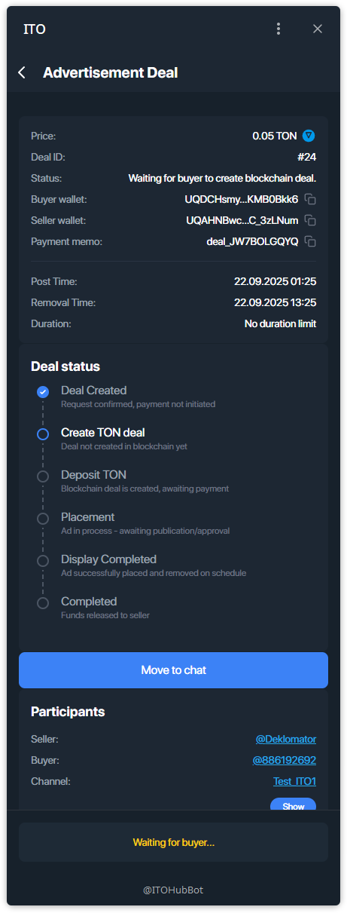
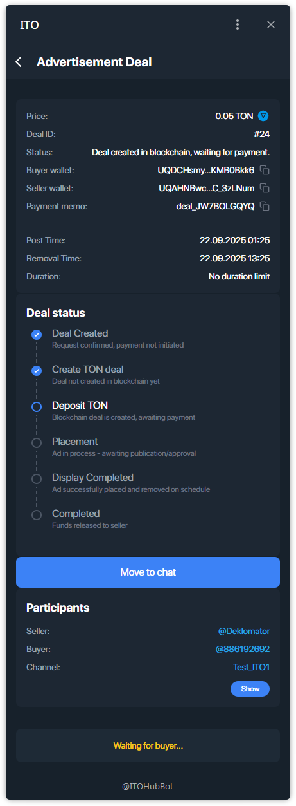
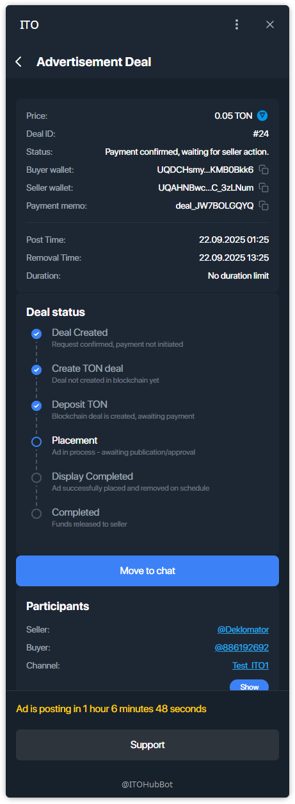
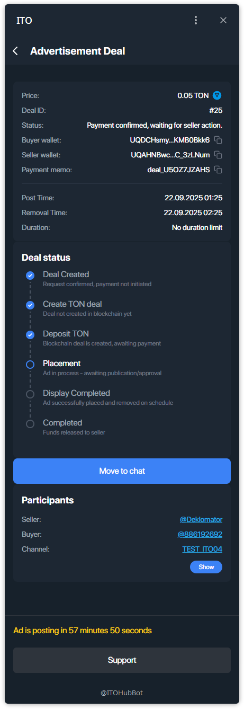
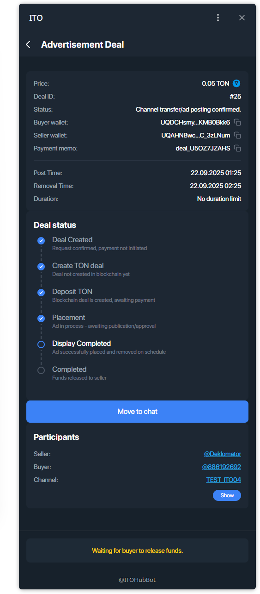

# Управление сделкой — Реклама (продавец)

Сценарий для **продавца** в **рекламной сделке**: подтверждение запроса → ожидание эскроу → бот сам публикует пост → средства выпускаются.

---

## Шаг 1 — Подтвердить запрос
Откройте **Main → My deals and offers** и нажмите **Approve** (или **Reject**).

После подтверждения на карточке будет **Payment Pending**.

---

## Шаг 2 — Детали сделки
В **Advertisement Deal** статусы идут так:
- **Waiting for buyer to create blockchain deal**  
- затем **Deal created in blockchain, waiting for payment**

---

## Шаг 3 — Эскроу оплачен → бот публикует пост автоматически
Когда покупатель вносит оплату в эскроу, статус меняется на  
**Payment confirmed, waiting for seller action**. Может появиться обратный отсчёт до публикации.

**Важно**
- **Публикацию выполняет бот автоматически** в момент **Post Time** и **постоянно проверяет наличие** поста до **Removal Time**.  
- Ручная публикация не требуется. При необходимости можно связаться через **Move to chat**.

---

## Шаг 4 — Показ завершён → ожидание выпуска средств
После окончания окна показа сделка переходит в **Display Completed**, затем в  
**Waiting for buyer to release funds**.

> Если процесс «завис», используйте **Support** на экране сделки.

---

## Шаг 5 — Завершение сделки и отзыв
Когда покупатель выпускает средства, появится **Deal complete. Funds released.**  
Оставьте оценку ★ и короткий отзыв о покупателе.

