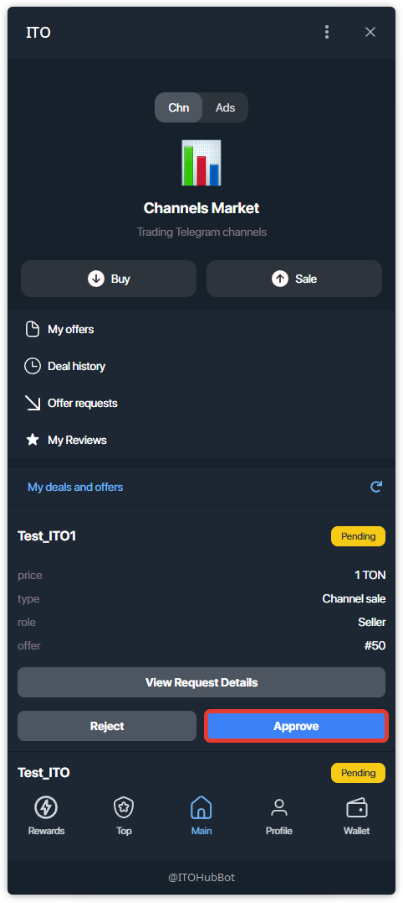
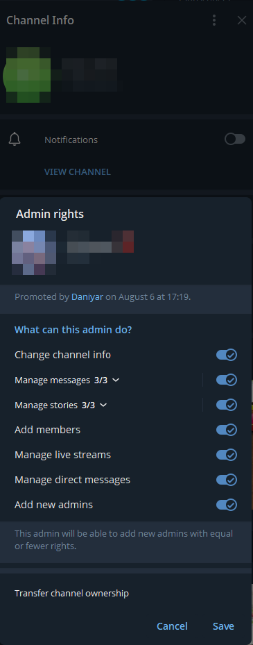
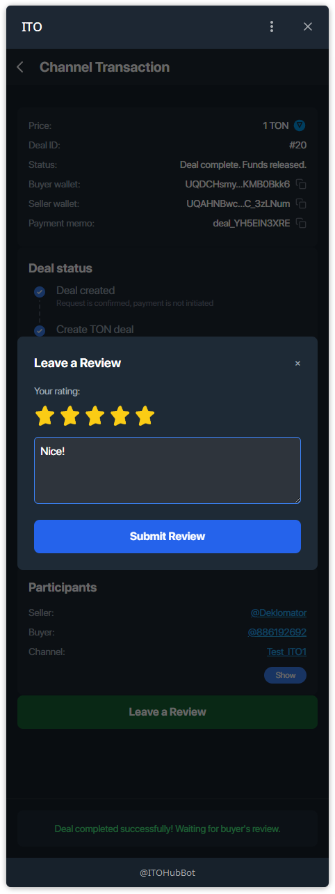
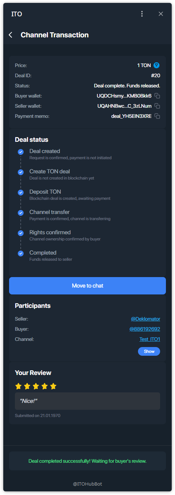
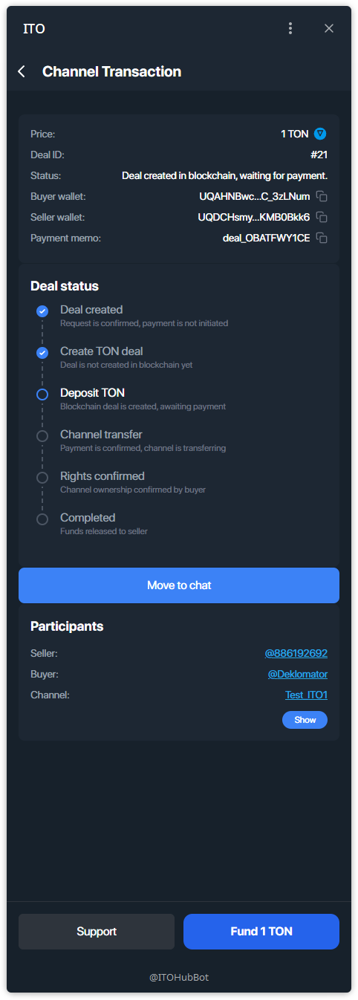
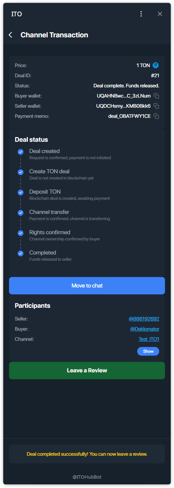

## RU — Поток продавца (Канал)

### Шаг 1 — Одобрите запрос покупателя
Откройте **Main → My deals and offers**. Найдите заявку и нажмите **Approve**.

### Шаг 2 — Ожидайте оплату покупателем
Сделка перейдёт в статус **Payment Pending**. Действий с вашей стороны пока нет.

### Шаг 3 — Следите за таймлайном сделки
Откройте карточку сделки. Там показаны шаги блокчейна:
- **Deal created**
- **Create TON deal** (создание on-chain сделки)
- **Deposit TON** (ожидание оплаты покупателем)

Сейчас статус: **Waiting for buyer to create blockchain deal**.

### Шаг 4 — Покупатель оплатил → требуется действие продавца
После зачисления в эскроу статус поменяется на **Payment confirmed, waiting for seller action**.

### Шаг 5 — Передайте права на канал в Telegram
В настройках канала Telegram:
1) При необходимости добавьте покупателя админом.  
2) Выполните **передачу владения каналом** на покупателя.  
Сохраните изменения.

### Шаг 6 — Подтвердите передачу в карточке сделки
Вернитесь к сделке и нажмите **I transferred channel** (или аналогичную кнопку).  
После подтверждения покупателем таймлайн перейдёт к **Rights confirmed**.

### Шаг 7 — Ожидайте release средств от покупателя
Когда покупатель подтвердит, система предложит ему разблокировать эскроу.

### Шаг 8 — Сделка завершена — оставьте отзыв
После релиза средств статус изменится на **Deal complete. Funds released.**  
Нажмите **Leave a Review**, чтобы оценить контрагента и оставить комментарий.

### Шаг 9 — Отзыв сохранён
Ваш отзыв появится в карточке сделки.

> **Уведомления бота:** На каждом ключевом шаге отправляются сообщения от ITO-бота (новый запрос, подтверждение передачи, релиз средств).

# Управление сделкой — Покупатель (Канал)

Инструкция по одобрению и завершению **сделки продажи канала** со стороны покупателя.

---

## Шаг 1 — Найдите свою сделку
Откройте **Main → My deals and offers**. Сделка помечена как **Payment Pending**.

## Шаг 2 — Создайте blockchain-сделку
Откройте карточку сделки и нажмите **Create Blockchain Deal**.

## Шаг 3 — Внесите депозит в эскроу
Нажмите **Fund 1 TON** и подтвердите оплату через **TON Connect** — средства будут заблокированы в эскроу.

## Шаг 4 — Ожидайте действия продавца
После оплаты статус станет **Payment confirmed, waiting for seller action**.  
Продавец должен передать вам владение каналом.

## Шаг 5 — Подтвердите получение (релиз средств)
Когда права на канал у вас, нажмите **Confirm Receipt** — эскроу переведёт средства продавцу.

## Шаг 6 — Сделка завершена — оставьте отзыв
После релиза средств сделка завершена. Вы можете **оставить отзыв**.

> Совет: используйте **Move to chat** в карточке сделки, чтобы согласовать детали передачи.
