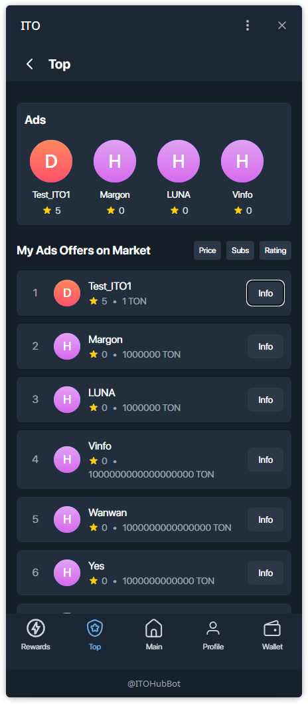
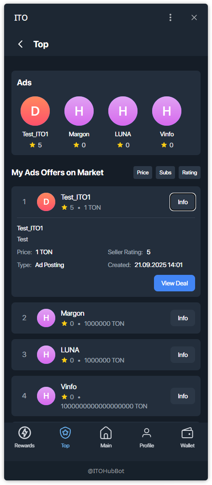
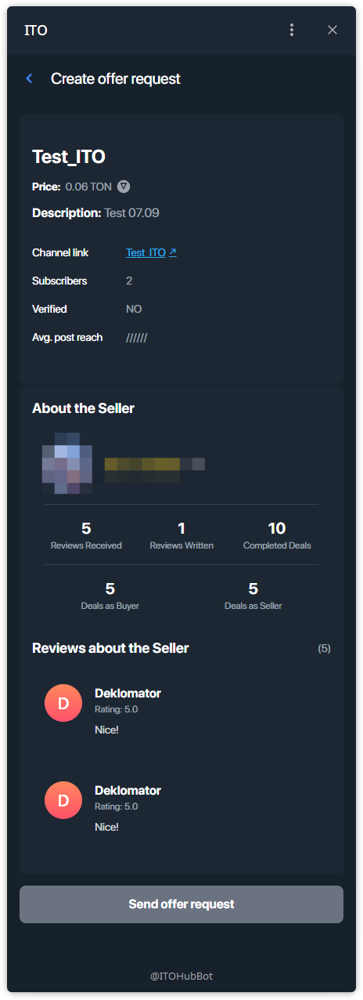

# Раздел TOP

Ранжированный список офферов и быстрый переход к сделке.

## Шаг 1 — Открыть TOP
- Нажмите **Top** на нижней панели.
- Вверху — витрина **Ads**, ниже — ранжированный список **My Ads Offers on Market**.

**Что видно:**
- Карусель **Ads**.
- Список с позициями (1, 2, 3…).
- Чипы сортировки: **Price**, **Subs**, **Rating**.
- Кнопка **Info** у каждой карточки.

---

## Шаг 2 — Сортировка и «Info»
- Переключайте **Price / Subs / Rating**, чтобы менять порядок.
- Нажмите **Info** — карточка развернётся: цена, рейтинг продавца, время создания и кнопка **View Deal**.

> Подсказка: ранжирование помогает быстро сравнить офферы без открытия каждого.

---

## Шаг 3 — Детали оффера → Отправка запроса
- Нажмите **View Deal**, чтобы открыть **детали оффера**: название, цена (TON), описание, ссылка на канал, подписчики, средний охват, профиль и отзывы продавца.
- Нажмите **Send offer request**, чтобы начать покупку.

> Далее: фандинг эскроу через TON Connect, действие продавца и завершение сделки.
