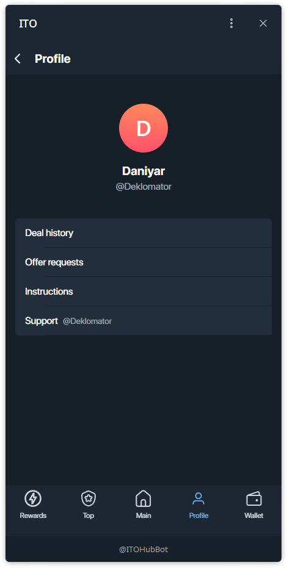
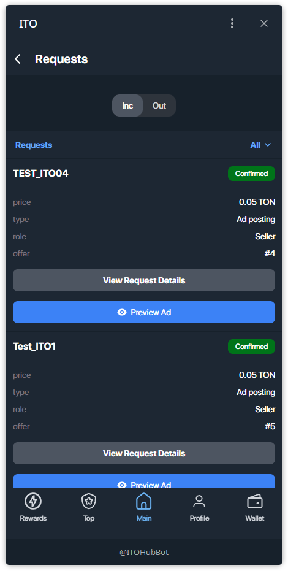

# Ваш Профиль и История

Экран "Profile" — это ваш личный кабинет в приложении. Здесь собрана основная информация о вас и предоставлен доступ к важным разделам.

### Основная информация

# Профиль и история

Откройте профиль на нижней панели навигации.

## Разделы
- **Deal history** — список ваших сделок со статусами.
- **Offer requests** — входящие/исходящие запросы по вашим офферам и покупкам.
- **Instructions** — быстрые инструкции/помощь.
- **Support** — контакт для связи.

---

## История сделок
В каждой записи указаны **цена**, **тип** (Channel sale / Ad posting), **ваша роль** (Buyer / Seller) и **ID оффера**.

**Примеры статусов:**
- **Progress Pending** — сделка в процессе, ожидается следующий шаг.
- **Completed** — успешно завершена.
- **Cancelled** — отменена.

---

## Запросы на офферы
Переключатель **Inc / Out** показывает **входящие** запросы к вам и **исходящие** — отправленные вами.

**Входящие (Inc):**

**Исходящие (Out):**

> Подсказка: метка **Confirmed** означает, что другая сторона подтвердила — выполняйте следующий шаг сделки.
